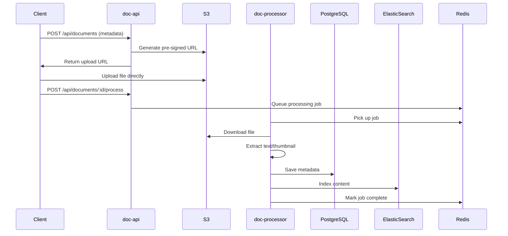
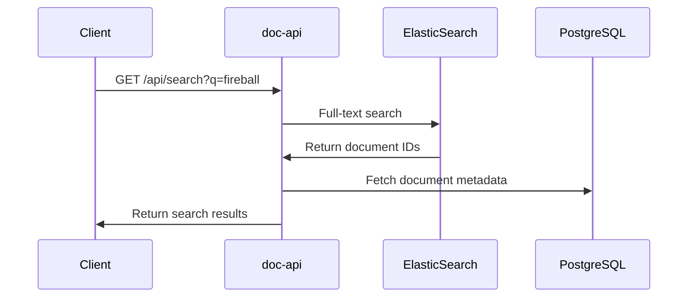
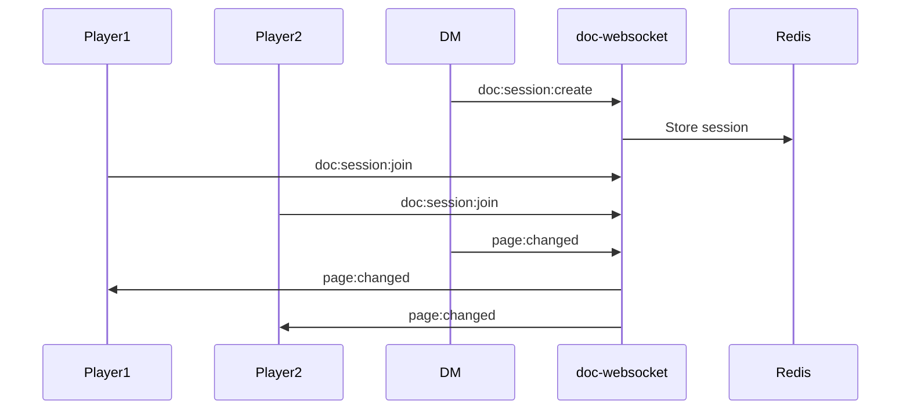

# Architecture Overview

## System Architecture

NexusCodex follows a microservices architecture with four main services orchestrated via Docker Compose.

```
┌─────────────────┐    ┌─────────────────┐    ┌─────────────────┐
│   Admin UI      │    │     doc-api     │    │  doc-websocket  │
│   (React)       │◄──►│   (Fastify)     │◄──►│   (Express+ws)  │
│   Port: 3001    │    │   Port: 3000    │    │   Port: 3002    │
└─────────────────┘    └─────────────────┘    └─────────────────┘
         │                       │                       │
         └───────────────────────┼───────────────────────┘
                                 │
                    ┌─────────────────┐
                    │  doc-processor  │
                    │   (BullMQ)      │
                    │   Background    │
                    └─────────────────┘
                                 │
                    ┌─────────────────┐
                    │   Databases     │
                    │ • PostgreSQL    │
                    │ • Redis         │
                    │ • ElasticSearch │
                    │ • S3/MinIO      │
                    └─────────────────┘
```

## Service Responsibilities

### doc-api (Port 3000)
**Primary REST API Service**
- Document CRUD operations
- User authentication and authorization
- File upload handling with S3 pre-signed URLs
- Search operations
- Admin management endpoints
- Queue job management

**Key Technologies:**
- Fastify framework
- JWT authentication
- Prisma ORM for PostgreSQL
- BullMQ for job queuing
- ElasticSearch client

### doc-processor (Background Worker)
**Document Processing Pipeline**
- PDF text extraction
- Image OCR processing
- Thumbnail generation
- Structured data extraction (D&D content)
- ElasticSearch indexing
- Content hash calculation

**Key Technologies:**
- BullMQ worker
- PDF.js for PDF processing
- Sharp for image manipulation
- Tesseract.js for OCR
- Custom extraction algorithms

### doc-websocket (Port 3002)
**Real-time Collaboration Server**
- WebSocket connections for document sessions
- Session management with Redis
- Page navigation synchronization
- Annotation real-time updates
- DM push features

**Key Technologies:**
- Express.js with ws library
- Redis for session storage
- Zod for event validation
- JWT for authentication

### admin-ui (Port 3001)
**Administration Interface**
- React-based dashboard
- Document management interface
- Queue monitoring
- System health monitoring
- User management
- Bulk operations

**Key Technologies:**
- React 18 with Vite
- TanStack Query for API calls
- shadcn/ui component library
- TailwindCSS for styling

## Data Flow

### Document Upload Flow



### Search Flow



### Real-time Collaboration Flow



## Database Architecture

### PostgreSQL (Primary Data Store)
- **Documents**: File metadata, processing status
- **Users**: Authentication and authorization
- **Structured Data**: Extracted D&D content
- **References**: Bookmarks and annotations
- **Tags**: Content categorization

### Redis (Caching & Queues)
- **BullMQ Queues**: Document processing jobs
- **Session Storage**: WebSocket session data
- **Job Logs**: Processing status and errors

### ElasticSearch (Search Index)
- **Document Content**: Full-text searchable content
- **Metadata**: Indexed document properties
- **Structured Data**: Searchable D&D content

### S3/MinIO (File Storage)
- **Document Files**: Original uploaded files
- **Thumbnails**: Generated preview images
- **Processed Assets**: Extracted content

## Security Model

### Authentication
- JWT-based authentication with access/refresh tokens
- Password hashing with bcrypt
- Role-based access control (admin/user)

### Authorization
- Route-level middleware for admin-only endpoints
- Session-based WebSocket authentication
- Pre-signed URL validation for file uploads

### Data Protection
- Environment variable configuration
- No secrets in codebase
- Secure defaults for development

## Scalability Considerations

### Horizontal Scaling
- Stateless API services
- Redis-backed session management
- Distributed job processing
- Load balancer friendly

### Performance Optimizations
- ElasticSearch for fast search
- Redis caching for session data
- Background processing for heavy operations
- CDN-ready static assets

### Monitoring
- Health check endpoints
- Performance metrics collection
- Queue monitoring
- Error logging and alerting