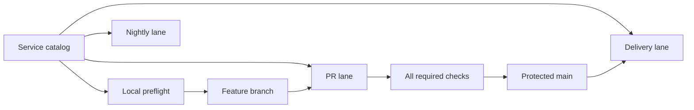

# CI/CD pipeline architecture

Nexus uses one service catalog and three GitHub Actions lanes. Pull requests get
fast feedback for affected targets, delivery publishes only trusted commits from
`main`, and expensive integration and security work runs nightly.



## Service catalog

`.github/ci/affected-targets.json` is the source of truth for:

- target paths, dependency fanout, CI groups, and lane membership;
- release image context, Dockerfile, target, repository, and platforms;
- Codex service language, test policy, and validation commands;
- full and affected delivery, security, Node, and Python matrices.

Run `npm run check:service-catalog` after changing it. The validator checks the
schema, dependency graph, repository paths, Dockerfiles, service manifests,
unique image names, and the complete `apps/codex/services` inventory. Invalid
catalog data fails closed; change detection does not keep a second fallback
service list.

To add a deployable service, add one target with its paths, lane membership,
service validation metadata when applicable, and `releaseImage` metadata. The
workflows consume generated matrices and should not gain a hand-written service
entry.

## Local preflight

Run the same repository contract checks before pushing:

```bash
npm run ci:preflight
```

The command runs workspace lock validation, catalog validation, Docker build
contracts, focused CI contract tests, and `actionlint`. It uses `ACTIONLINT_BIN`
or a local `actionlint` executable when available, then falls back to the pinned
`rhysd/actionlint:1.7.12` container image.

Husky's `.husky/pre-push` hook blocks updates to `main` and runs the preflight.
`ALLOW_PROTECTED_BRANCH_PUSH=1` is an emergency local bypass for the hook only;
it does not bypass GitHub repository rules or branch protection.

## Pipeline lanes

| Lane         | Workflow                         | Trigger                                   | Owns                                                                                                                               |
| ------------ | -------------------------------- | ----------------------------------------- | ---------------------------------------------------------------------------------------------------------------------------------- |
| Pull request | `.github/workflows/ci.yml`       | PRs to `main`, merge queue, manual        | Catalog and repository contracts plus affected-target lint, type-check, compilation, and unit-level tests                          |
| Delivery     | `.github/workflows/delivery.yml` | Push to protected `main`, manual recovery | Affected immutable image builds, digest promotion, release manifest, and documentation deployment                                  |
| Nightly      | `.github/workflows/nightly.yml`  | Daily schedule, manual                    | Database integration, managed E2E, multiplayer chaos soak, full security scans, OCR model downloads, and optional A2000 validation |

The PR workflow preserves the aggregate status name `All required checks`.
Branch protection only needs that stable check even though affected jobs are
conditional.

## Pull-request lane

`scripts/ci/affected-targets.mjs` compares the PR source with its merge base and
uses the catalog to calculate dependency fanout. Unknown paths or failed change
detection select every target conservatively. Root packages, lockfiles, CI
configuration, deployment files, and shared scripts intentionally fan out.

The lane never publishes images or deploys documentation. Database-backed
integration tests, managed E2E, container vulnerability scans, and soak tests
belong to nightly validation.

## Delivery lane

Delivery accepts only commits reachable from `origin/main`. Automatic runs use
the exact pushed SHA. Each affected image is built once and pushed as
`sha-<40-character-source-sha>`. Promotion resolves those immutable tags to
digests, applies version and `latest` tags with `docker buildx imagetools`, and
stores the complete digest set in `release/images.json`.

If a manual delivery is superseded by a newer `main`, immutable images remain
available but mutable tags are not changed. Unaffected images are not rebuilt;
their current digests are carried into the manifest.

## Nightly lane

Nightly validates the expensive system boundaries omitted from PRs:

- VTT PostgreSQL and Redis integration through Docker Compose;
- production-stack Playwright smoke tests;
- Codex API integration with PostgreSQL, Redis, and Elasticsearch;
- full CodeQL, Trivy, Grype, container scans, and SBOM generation;
- OCR and embedding model initialization;
- managed multiplayer soak with database and coordinator disruption.

The RTX A2000 job is skipped until repository variable
`A2000_RUNNER_ENABLED=true` is set or a manual run selects `run_a2000`. The
self-hosted runner must have labels `self-hosted`, `linux`, `x64`, and `a2000`,
Docker with NVIDIA Container Toolkit, and access to `nvidia-smi`. The job
requires the built OCR image to expose a CUDA ONNX execution provider and runs
an embedding on the GPU.

## Protected main

Configure the `main` branch or repository ruleset with:

- pull requests required before merge;
- required status check `All required checks`, with the branch up to date;
- force pushes and branch deletion disabled;
- conversation resolution required;
- the merge queue enabled when used by the repository.

Administrators and coding agents should work from `codex/*` or another feature
branch and merge through a pull request. Keep the required check name stable
when reorganizing internal jobs.

## Focused verification

Useful commands while changing pipeline contracts are:

```bash
npm run check:service-catalog
npm run test:affected-targets
npm run test:ci-contracts
npm run check:workflows
npm run ci:preflight
```
