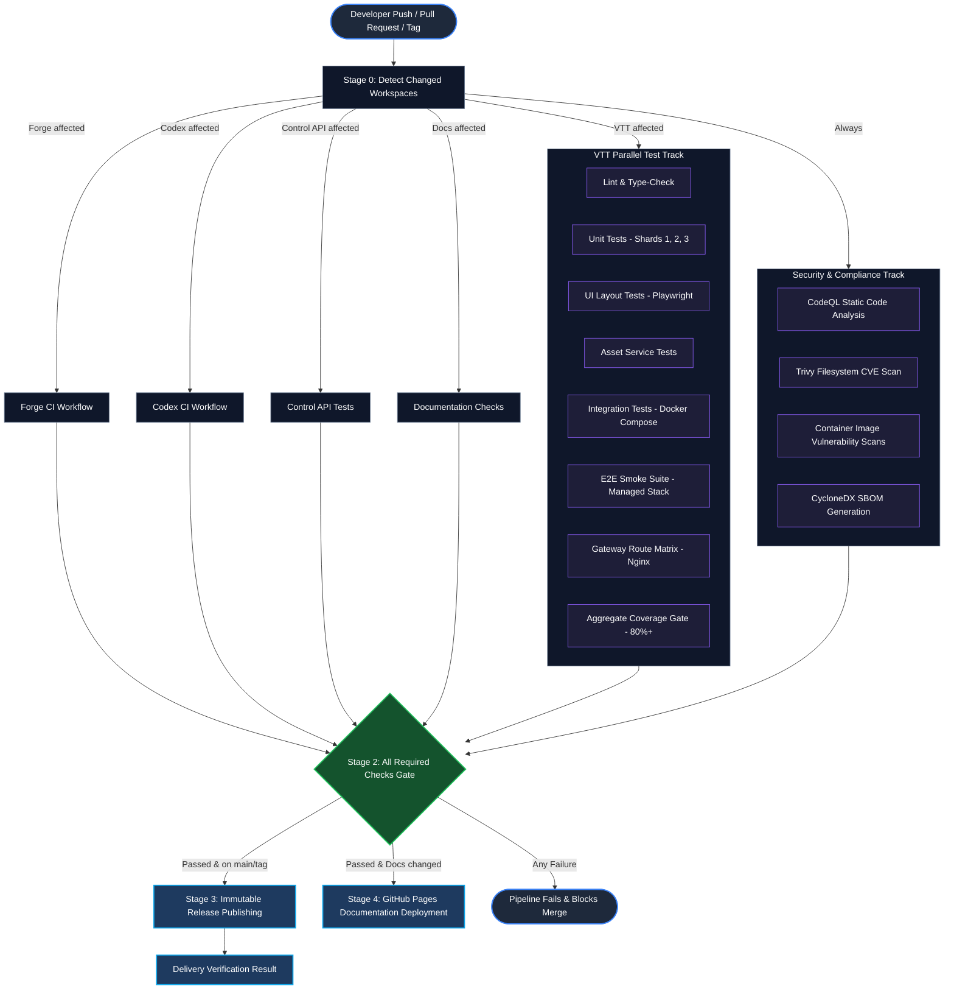
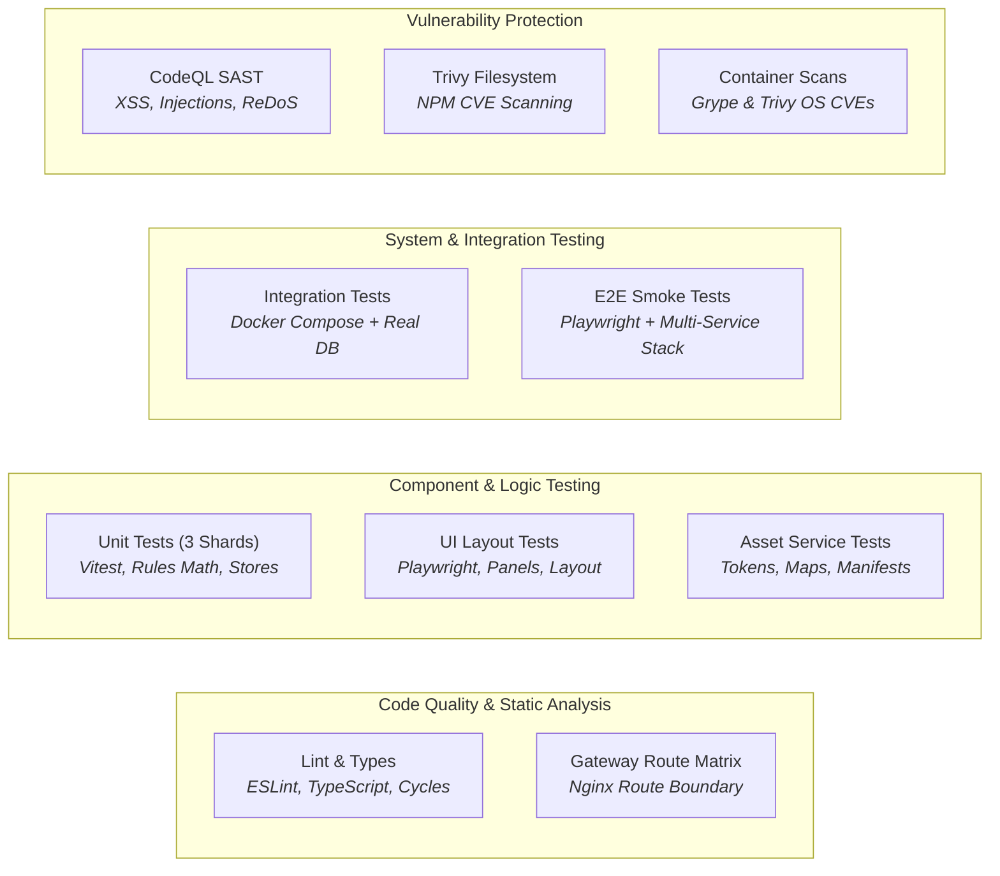
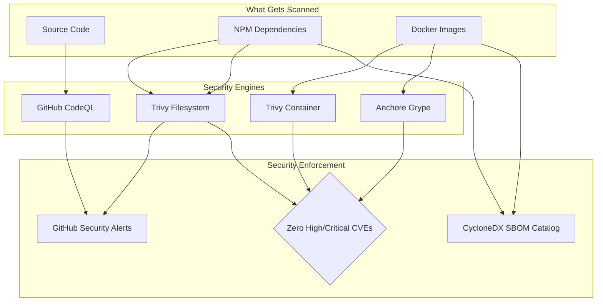
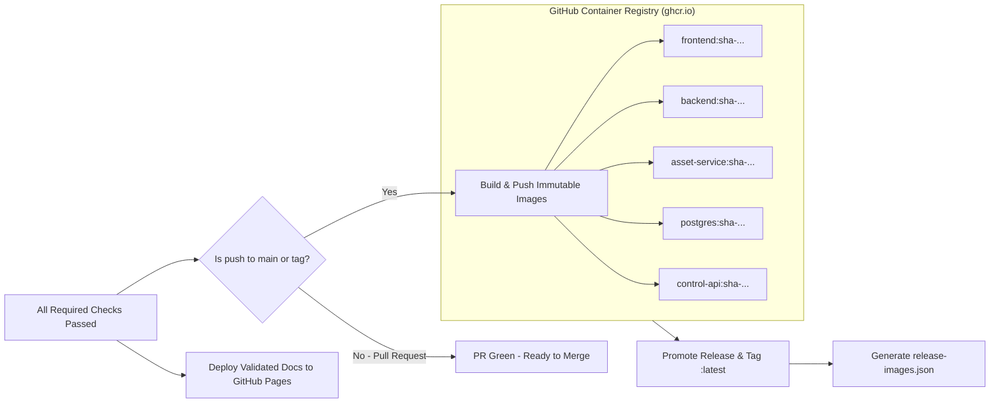
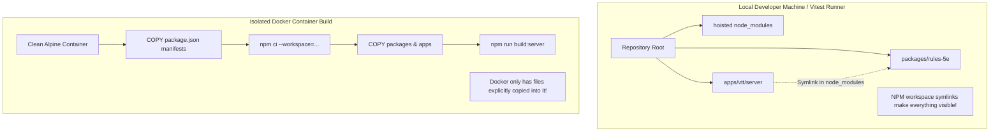
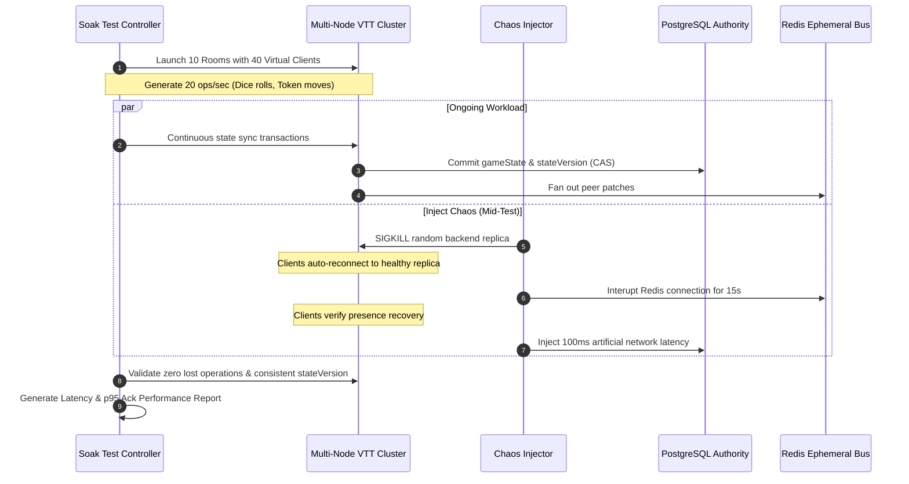

# Nexus CI/CD Pipeline Architecture & Guide

Nexus uses a unified, multi-track continuous integration and continuous delivery (CI/CD) system orchestrated via GitHub Actions. Because Nexus is a monorepo containing multiple interconnected applications (Nexus Virtual Tabletop, Forge Character Builder, NexusCodex Document Services, and Private Control API), the CI/CD pipeline is designed to provide **strict safety guarantees** without unnecessary rebuilds.

This guide explains how the pipelines work, what each test stage does across the codebase, why each check exists, and how containerized validation guarantees production reliability—written for team members who want clear, accessible explainability without needing to decipher thousands of lines of workflow YAML.

---

## 1. High-Level Pipeline Architecture

When code is committed, pushed to `main`, opened as a Pull Request, or released as a version tag, GitHub Actions executes an orchestrated sequence of change-detection, parallel testing, security scanning, consensus gating, and immutable image publishing.



---

## 2. The 5 Pipeline Families

The `.github/workflows/` directory contains five dedicated workflow families:

| Workflow File | Name | Trigger Conditions | Primary Responsibility |
| :--- | :--- | :--- | :--- |
| **`ci.yml`** | **CI Pipeline** (Main Orchestrator) | Push to `main`, Tags (`v*`), Pull Requests, Manual Dispatch | The central engine. Runs workspace detection, fans out to parallel test tracks, aggregates test coverage, validates release gates, and builds production Docker images. |
| **`security-reusable.yml`** | **Reusable Security Validation** | Called by `ci.yml` and `security.yml` | Executes CodeQL static application security testing (SAST), Trivy filesystem vulnerability scans, and container image scans using Trivy and Grype. |
| **`security.yml`** | **Release Security Wrapper** | GitHub Release published or Manual Dispatch | Attaches cryptographically verified Software Bills of Materials (SBOMs) to official releases after full vulnerability scanning. |
| **`forge-ci.yml`** | **Forge CI** | Called by `ci.yml` or Manual Dispatch | Validates the Forge character builder and rules editor (type checking, linting, Vitest tests, and container image compilation). |
| **`codex-ci.yml`** | **Codex CI** | Called by `ci.yml` or Manual Dispatch | Validates NexusCodex microservices (`doc-api`, `doc-processor`, `doc-websocket`, `admin-ui`, `dm-ui`), running unit tests and live multi-container integration tests with PostgreSQL, Redis, and Elasticsearch. |
| **`multiplayer-soak.yml`** | **Multiplayer Soak** | Daily at 05:30 UTC or Manual Dispatch | Endurance and chaos stress testing. Simulates 10 rooms with 40 simultaneous players actively rolling dice and moving tokens under network and database disruptions. |
| **`docs-pages.yml`** | **Deploy Docs to GitHub Pages** | Manual Fallback Dispatch | Emergency/standalone deployment of the Docusaurus documentation website to GitHub Pages (automatic deployment occurs in `ci.yml`). |

---

## 3. Stage-by-Stage Breakdown (What We Test and Why)

Here is a plain-language explanation of each stage in the main pipeline (`ci.yml`), describing what it checks across the codebase, how it executes, and why it is critical.

### Stage 0: Change Detection (`Detect changed workspaces`)
* **What it tests**: Looks at the Git change history (`git diff`) between the incoming commit and the base branch to determine which parts of the monorepo were touched (`apps/vtt`, `apps/forge`, `apps/codex`, `apps/control-api`, or `apps/docs`).
* **Why it matters**: In a large monorepo, running all tests for all applications on every tiny typo fix would waste 20+ runner minutes. If a developer only updates documentation, the pipeline runs documentation checks and skips heavy game-engine smoke tests.
* **The Root Rule**: If root configuration files (such as `package.json`, `package-lock.json`, or shared `packages/**` contracts) are touched, the filter automatically marks **every** workspace as affected, because a change to shared libraries can break all downstream apps.

---

### Stage 1: The Parallel Validation Matrix

When workspaces are flagged as affected, GitHub Actions launches parallel validation jobs simultaneously.



#### 1. `VTT: lint and type-check` (Code Health & Standards)
* **What it does**: 
  - Runs **TypeScript type checking** (`tsc`) to verify that all interfaces, types, and function signatures match without runtime type errors.
  - Runs **ESLint** to enforce coding conventions, catch syntax errors, and ban dangerous constructs (such as `any`).
  - Runs **circular dependency checks** (`check:cycles`) to ensure modules don't import each other in infinite loops.
  - Validates **dice assets** and ensures the workspace lockfile is synchronized.
* **Plain-language analogy**: The automated proofreader checking grammar, vocabulary, and structural layout before printing.

#### 2. `VTT: unit tests` (Math, Rules, and State Logic in 3 Shards)
* **What it does**: Tests isolated software components in memory using Vitest. It tests character sheet calculations, D&D 5e ability score modifiers, spell slot matrices, condition trackers, inventory weight math, and Zustand state stores.
* **Why it uses 3 Shards**: The VTT has hundreds of unit tests. Running them on a single runner would take 7–9 minutes. The pipeline splits tests across three parallel runners (`shard 1/3`, `2/3`, `3/3`), reducing test time to ~2 minutes.
* **Provenance Manifest**: Each shard uploads a cryptographically signed coverage report blob (`vtt-coverage-unit-X`).

#### 3. `VTT: UI layout tests` (Visual & Layout Stability)
* **What it does**: Launches headless Chromium using Playwright to render the actual React frontend in a test browser. It exercises window resizing, dockable sidebars, floating windows (character sheets, combat trackers), and verifies that panels do not crash when dragged or layered.
* **Why it matters**: Unit tests test code logic in memory, but they cannot verify whether CSS layout rules or z-index collisions break user interaction in a real browser.

#### 4. `VTT: asset-service tests` (Map & Token Cataloging)
* **What it does**: Verifies the microservice responsible for cataloging maps, tokens, monster portraits, and dice skins. It ensures that file upload parsers, metadata extractors, and thumbnail generators operate correctly without corrupting assets.

#### 5. `VTT: integration tests` (Real Database & Realtime Wiring)
* **What it does**: Launches a complete **Docker Compose** environment containing live PostgreSQL and Redis instances. It executes server endpoints, user authentication flows, database migration scripts, and state-projection transactions.
* **Why it matters**: Mocks can lie. Testing against genuine PostgreSQL ensures that SQL transactions, row locking, and compare-and-swap operations work exactly as they will in production.

#### 6. `VTT: E2E smoke (managed stack)` (End-to-End User Journeys)
* **What it does**: The most comprehensive test in the system. It builds the production backend and frontend Docker containers, brings up the full managed stack, and uses Playwright to simulate multiple players opening browsers, connecting via WebSockets, creating campaigns, rolling 3D dice, and synchronizing token movements in real time.
* **What it guards against**: It ensures that a real user visiting the website can successfully load assets, establish WebSocket connections, and play without encountering white screens or disconnected sessions.

#### 7. `VTT: gateway route matrix` (Security & Reverse Proxy Boundary)
* **What it does**: Launches the production Nginx reverse proxy configuration and fires HTTP requests against both the public interface (port `80`) and the private admin interface (port `8081`).
* **Why it matters**: Prevents accidental leakage of sensitive internal admin endpoints (such as `/admin`, control APIs, or debug tooling) to the public internet.

#### 8. `VTT: aggregate coverage` (The 80%+ Test Coverage Gate)
* **What it does**: Downloads the coverage blobs from all 3 unit test shards and the integration test suite, verifies that they belong to the exact source commit, merges them together, and enforces the repository threshold.
* **The Rule**: Overall code coverage must meet the repository's strict policy. If new code is added without accompanying tests, the coverage gate fails the entire pipeline.

---

### Stage 2: Security Validation Suite

Nexus runs automated security analysis as an integral part of every CI run:



1. **CodeQL Static Code Analysis**: Scans TypeScript and JavaScript code for security vulnerabilities such as Cross-Site Scripting (XSS), SQL injection, Prototype Pollution, and Regular Expression Denial of Service (ReDoS). Findings are reported directly to GitHub's Security dashboard.
2. **Trivy Filesystem Scan**: Scans the `package-lock.json` dependency tree against known vulnerability databases (CVEs). Any **HIGH** or **CRITICAL** vulnerability with an available patch immediately breaks the build.
3. **Container Vulnerability Scans (Trivy & Anchore Grype)**: Builds the `frontend` and `backend` Docker containers and scans the entire underlying Linux operating system (Alpine packages, system libraries) using two independent scanners (Trivy and Grype). This dual-engine approach prevents blind spots.
4. **Software Bill of Materials (SBOM)**: Generates standard **CycloneDX** SBOM files cataloging every single package and dependency in the build, archiving them for regulatory compliance and software supply chain security.

---

### Stage 3: The All Required Checks Gate (`required`)

In GitHub branch protection rules, requiring 20 individual dynamic jobs can lead to brittle setups when some jobs are conditionally skipped. 

To solve this, Nexus uses an **aggregator gate job**:
* The `required` job evaluates the final status of every upstream validation job.
* It verifies that all mandatory jobs succeeded and that conditional jobs (like Forge or Codex) either succeeded or were legitimately skipped based on change detection.
* **Result**: Pull Requests only need to protect the single status check `All required checks`. If any individual test or security scanner fails, this gate fails.

---

### Stage 4: Publication & Delivery

Once all tests, security scans, and coverage gates pass, the pipeline handles delivery:



1. **Immutable Image Publication (`publish-images`)**:
   - Compiles production Docker images for `frontend`, `backend`, `asset-service`, `postgres`, and `control-api`.
   - Tags each image with the exact, immutable Git commit SHA: `ghcr.io/joelmale/nexusvtt/<service>:sha-<commit-sha>`.
   - Pushes them to the GitHub Container Registry.
2. **Release Promotion (`promote-release`)**:
   - Ensures that images are never blindly tagged as `:latest` until the full release manifest is generated.
   - Updates `:latest` and date/version tags, recording image digests in `release/images.json`.
3. **Documentation Deployment (`deploy-docs`)**:
   - Automatically publishes the compiled Docusaurus website artifact produced in `docs-checks` to GitHub Pages, ensuring documentation is always live and up to date.

---

## 4. Deep Dive: Why Docker Builds Break When Packages Are Added

A common question for developers is:

> *"My code compiles locally, and my unit tests pass on my machine! Why did 4 CI pipeline jobs suddenly fail when I pushed?"*

Understanding the difference between the **local monorepo environment** and the **isolated Docker container build environment** clarifies why this occurs.

### The Monorepo Illusion vs. Docker Reality



#### Why it happens:
1. **Local Symlinks**: On your local workstation, `npm install` creates automatic symlinks inside `node_modules` pointing directly between workspaces. If `apps/vtt` references `@nexus/rules-5e`, Node immediately resolves it via the local symlink.
2. **Docker Isolation & Layer Caching**: In `apps/vtt/docker/backend.Dockerfile` and `frontend.Dockerfile`, Docker does **not** copy the whole repository at once. To keep build times fast and leverage Docker layer caching, Dockerfiles explicitly declare:
   - Which package manifests (`package.json`) to copy.
   - Which workspaces to install via `npm ci --workspace=...`.
   - Which contract packages to build in sequence (`npm run build --workspace=...`).
3. **The Missing Dependency Cascade**:
   - When a new contract package (like `@nexus/rules-5e`) is imported into `apps/vtt/server/commands/DomainCommandService.ts`, the server code now requires that package to compile.
   - If `backend.Dockerfile` only lists `@nexus/character-contracts`, `@nexus/game-contracts`, and `@nexus/rules-contracts`, the Docker container has **no knowledge** of `@nexus/rules-5e`.
   - When Docker tries to build the server (`npm run build:server`), TypeScript fails:
     ```text
     Cannot find module '@nexus/rules-5e' or its corresponding type declarations.
     ```

#### Why 4 pipelines failed at once:
When `backend.Dockerfile` cannot compile, it breaks multiple dependent jobs simultaneously:
1. **`Security validation / Container scan: backend`** fails because Buildx cannot build the scanner image.
2. **`VTT: E2E smoke (managed stack)`** fails because `docker-compose.smoke.yml` uses `backend.Dockerfile` to spin up the test backend.
3. **`All required checks`** fails because jobs 1 and 2 failed.
4. **`Delivery result`** fails because the required gate failed.

### The Developer Checklist When Adding Monorepo Packages

Whenever a new package is created in `packages/<new-package>` and imported by an app:

* [ ] **1. Root `package.json`**: Add the workspace to `"install:vtt"` and `"build:contracts"`.
* [ ] **2. `apps/vtt/docker/backend.Dockerfile`**:
  - Add `COPY --chown=nodejs:nodejs packages/<new-package>/package.json ./packages/<new-package>/package.json`
  - Add `--workspace=@nexus/<new-package> \` to `RUN npm ci`
  - Add `npm run build --workspace=@nexus/<new-package> && \` before `build:server`
* [ ] **3. `apps/vtt/docker/frontend.Dockerfile`**:
  - Add the package manifest copy and workspace to builder stages.
* [ ] **4. Verify Locally with Docker Before Pushing**:
  ```bash
  docker build -f apps/vtt/docker/backend.Dockerfile -t nexus-vtt/backend:test .
  ```

---

## 5. Nightly Soak & Chaos Testing (`multiplayer-soak.yml`)

While the standard CI pipeline validates code correctness on every push, real-time multiplayer applications face unique challenges: memory leaks, WebSocket reconnection storms, race conditions, and database lock contention under load.

Nexus runs an automated **Multiplayer Soak Pipeline** every morning at 05:30 UTC:



### Key Soak Metrics & SLOs
* **Rooms & Clients**: 10 simultaneous game sessions, 4 connected players per room.
* **Operation Rate**: 20 operations per second sustained over 10 minutes.
* **Chaos Injection**: Automatically kills backend containers, interrupts Redis, and injects PostgreSQL latency to ensure players never lose session state during network hiccups.
* **SLO Enforcement**:
  - Reconnect 95th percentile latency must be under **15 seconds**.
  - Action acknowledge 95th percentile latency must be under **2 seconds**.
  - Total lost states: **0** (enforced by the PostgreSQL durable compare-and-swap contract).

---

## 6. Summary Quick Reference

| Problem | Where to Look | How to Fix |
| :--- | :--- | :--- |
| **Lint or Type-Check fails** | `VTT: lint and type-check` | Run `npm run type-check --workspace=nexus-vtt` and `npm run lint --workspace=nexus-vtt` locally. |
| **Unit test failure** | `VTT: unit tests (shard X)` | Run `npm run test:unit` in `apps/vtt`. Check the failed assertion in Vitest. |
| **Coverage drops below 80%** | `VTT: aggregate coverage` | Check `coverage-input` artifact. Add unit tests for recently introduced branches or functions. |
| **Docker build fails with missing module** | `Container scan: backend` or `frontend` | Verify that `backend.Dockerfile` and `frontend.Dockerfile` copy and install newly added package workspaces. |
| **E2E Smoke test fails** | `VTT: E2E smoke` | Download `playwright-smoke-report` artifact to view screenshots, video recordings, and trace viewer logs of the browser failure. |
| **Security scan fails with CVE** | `Security validation / Trivy Filesystem Scan` | Check the vulnerability table in the job log. Upgrade the offending npm package in `package.json`. |
