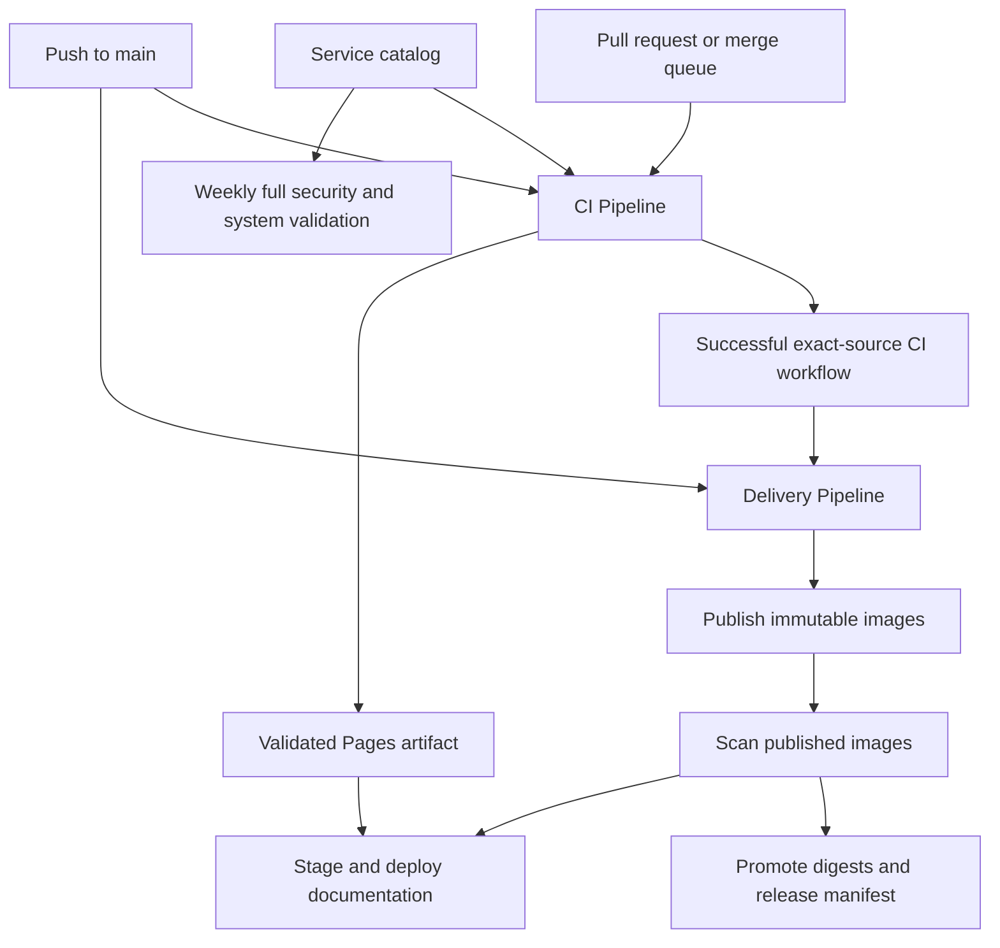

# CI/CD pipeline architecture

Nexus uses one service catalog to select validation jobs and release images.
CI validates pull requests and pushes to `main`; Delivery requires a successful
CI workflow for the exact source commit before publishing images or deploying
documentation. VTT database integration runs only in the weekly lane
(`nightly.yml`, named Weekly Validation), alongside the other system checks.

This page describes the checked-in configuration as of October 1, 2026.
Workflow files and `scripts/ci/` define execution behavior; branch protection and
repository variables are GitHub settings configured separately.


```mermaid
flowchart TD
  Catalog[Service catalog] --> CI[CI Pipeline]
  PR[Pull request or merge queue] --> CI
  Main[Push to main] --> CI
  Main --> Delivery[Delivery Pipeline]
  CI --> Evidence[Successful exact-source CI workflow]
  Evidence --> Delivery
  Delivery --> Images[Publish immutable images]
  Images --> Scan[Scan published images]
  Scan --> Promote[Promote digests and release manifest]
  CI --> Pages[Validated Pages artifact]
  Pages --> Docs[Stage and deploy documentation]
  Scan --> Docs
  Catalog --> Weekly[Weekly full security and system validation]
```

## Service catalog

`.github/ci/affected-targets.json` is the source of truth for:

- target paths, dependency fanout, CI groups, and lane membership;
- release image context, Dockerfile, target, repository, and platforms;
- Codex service language, test policy, and validation commands;
- full and affected delivery, security, Node, and Python matrices.

Changes to pipeline workflows and `.github/ci/**` fan out to every target.
Dependabot configuration and its auto-merge workflow are classified by the
`dependabot-automation` rule with no targets, so those PRs skip the target
suites. A `.github` file that no rule lists is treated as unknown and runs the
full suite; add new workflow files to `ci-configuration` deliberately.
`nightly.yml`, `security.yml` (release) and `multiplayer-soak.yml` do not run in
the PR or Delivery lanes, so they are classified by the
`scheduled-and-release-workflows` rule with no targets.

Run `npm run check:service-catalog` after changing it. The validator checks the
schema, dependency graph, repository paths, Dockerfiles, service manifests,
unique image names, and the complete `apps/codex/services` inventory. Invalid
catalog data fails closed; change detection does not keep a second fallback
service list.

To add a deployable service, add one target with its paths, lane membership,
service validation metadata when applicable, and `releaseImage` metadata. The
workflows consume generated matrices and should not gain a hand-written service
entry.

## Local preflight

Run the same repository contract checks before pushing:

```bash
npm run ci:preflight
```

The command runs workspace lock validation, catalog validation, Docker build
contracts, startup migration checks, focused CI contract tests, and `actionlint`. It uses `ACTIONLINT_BIN`
or a local `actionlint` executable when available, then falls back to the pinned
`rhysd/actionlint:1.7.12` container image.

Husky's `.husky/pre-push` hook runs the preflight before every push. Protecting
`main` is left to GitHub branch protection or repository rulesets.

Preflight checks repository contracts rather than the complete application test
suite. The CI `repository-contracts` job runs lock, catalog, Docker contract,
CI contract-test, and workflow checks; startup migration validation is currently
an additional local preflight step.

## Pipeline lanes

| Lane              | Workflow                         | Trigger                                              | Owns                                                                                                                                      |
| ----------------- | -------------------------------- | ---------------------------------------------------- | ----------------------------------------------------------------------------------------------------------------------------------------- |
| CI                | `.github/workflows/ci.yml`       | PRs to `main`, pushes to `main`, merge queue, manual | Repository contracts, affected application checks, E2E, unit coverage aggregation, and security reporting                                 |
| Delivery          | `.github/workflows/delivery.yml` | Push to `main`, manual recovery                      | Exact-source CI evidence, immutable image publication, published-image security, digest promotion, release manifest, and Pages deployment |
| Weekly validation | `.github/workflows/nightly.yml`  | Monday at 05:30 UTC, manual                          | VTT integration/E2E, full Codex validation and security, chaos soak, OCR model warmup, and optional A2000 validation                      |

The PR workflow preserves the aggregate status name `All required checks`.
Use that stable check for branch protection even though affected jobs are
conditional. It validates successful repository contracts and selected jobs,
and expects unselected application jobs to be skipped. Security failures
currently warn without failing this aggregate check.

## CI validation lane

`scripts/ci/affected-targets.mjs` compares the PR source with its merge base and
uses the catalog to calculate dependency fanout. PRs use their base SHA;
main-push CI uses the previous push SHA. Merge-queue, manual, schedule, and release
events select the full suite. Unknown paths or failed change
detection select every target conservatively. Root manifests, lockfiles, CI
configuration, and shared scripts intentionally fan out. Each `packages/<name>`
rule lists only the images that consume that package. Deployment and monitoring
files, repository docs, and editor or agent configuration select no target. An
uncatalogued new package is an unknown path, so add a rule for it.

The lane never publishes images or deploys documentation. Node workflows
currently use Node.js `26.5.1` and the root npm lockfile. Jobs check out the source
SHA resolved by `changes`, which also uploads an affected-target report.

| Selected target | Validation                                                                                                                                                       |
| --------------- | ---------------------------------------------------------------------------------------------------------------------------------------------------------------- |
| VTT             | Lint, type-check, import cycles, dice assets, client/server build; three unit shards; Chromium UI layout tests; exact-image managed E2E; aggregate unit coverage |
| Assets          | Asset-service tests                                                                                                                                              |
| Gateway         | Gateway route matrix                                                                                                                                             |
| Control API     | Lint, type-check, tests                                                                                                                                          |
| Forge           | Reusable `forge-ci.yml`: type-check, lint, tests with coverage, production build                                                                                 |
| Codex           | Reusable `codex-ci.yml`: test inventory, catalog-selected Node/Python validation, and doc-api unit/build/integration checks when doc-api is selected             |
| Docs            | Type-check and Docusaurus build; main-push runs upload the validated Pages artifact                                                                              |

Codex doc-api integration uses PostgreSQL, Redis, and Elasticsearch. The
VTT managed E2E smoke suite and database integration suite run in weekly
validation. See the [CI test catalog](./ci-test-catalog.md) for individual suite
details.

### Coverage and security policy

PR VTT coverage combines the three unit blobs (`--integration-count 0`;
integration runs weekly and is not part of PR coverage). Provenance
validation requires the complete expected report set from the same source SHA.
Tests and report validation must succeed, but coverage percentages are advisory:
workflow thresholds are zero and `coverage-warn.mjs` reports against
`apps/vtt/coverage-targets.json`.

CI always requests repository CodeQL and Trivy filesystem scans. It also scans
affected non-advisory container images, except for Dependabot npm/Actions PRs,
which pass an empty image matrix. The advisory OCR image is scanned in weekly,
release, and Delivery validation.

`security-reusable.yml` reports SARIF, verifies image source provenance, and
enforces Trivy HIGH/CRITICAL and Grype high-severity policies. Trivy includes
unfixed vulnerabilities; Grype gates only findings with fixes. Images marked
`securityAdvisory` (currently `codex-ocr`) allow vulnerability-enforcement steps
to fail; build, scan infrastructure, and provenance errors can still fail jobs.
CycloneDX SBOM generation runs outside PR events.

**Merge and delivery have different security gates.** The CI aggregate check
allows security failures with a warning. Delivery requires its security workflow
to succeed before promotion or Pages deployment. Delivery scans published images
with `repository_scan: false`, relying on CI to have run repository scans.
A successful CI workflow therefore does not prove that all repository security
checks passed under the current advisory merge policy.

### Concurrency and cancellation

A newer push cancels the older in-progress CI run, both per pull request and
for pushes to `main`. A cancelled run on `main` is never green, so Delivery's
exact-source validation gate rejects that SHA and does not publish it; the newer
commit carries its changes. Merge-queue and manual runs are never cancelled.
Delivery itself is not cancelled, so image publishing and promotion are never
interrupted midway. The policy and its rationale are commented on the
`concurrency` block in `ci.yml`.

## Delivery lane

Delivery accepts only commits reachable from `origin/main`. Automatic runs use
the exact pushed SHA and wait up to 40 minutes for a successful completed **push**
CI workflow for that SHA. A green PR aggregate alone is insufficient.

Affected images are calculated against the **last promoted release**, so changes
from superseded, unpromoted pushes remain eligible in the next release. The
baseline lookup can request a full build when no usable baseline exists.

Each affected image is built once and pushed as
`sha-<40-character-source-sha>`. Promotion resolves those immutable tags to
digests, applies version and `latest` tags with `docker buildx imagetools`, and
stores the complete digest set in `release/images.json`. Version tags have the
form `YYYYMMDD-<7-character-sha>`. Delivery security pulls and scans the published
images without rebuilding, and promotion depends on successful publication and
security. Promotion rechecks eligibility against current main before updating
mutable tags. When no images are affected, publication and promotion skip.

Build caching: `codex-ocr` (CUDA torch, several GB) uses a GHCR registry cache
(`<repository>:buildcache`) written by Delivery, so an unchanged rebuild reuses
its layers. The GitHub Actions cache cannot hold it: exporting it took about
14 minutes per build and the 10 GB repository cap evicts it. The security
workflow reads the registry cache for advisory images and never writes a GHA
cache for them. Every other image keeps its per-image GHA cache scope.

If delivery is superseded by a newer `main`, immutable images remain
available but mutable tags are not changed. Unaffected images are not rebuilt;
their current digests are carried into the manifest.

### Documentation deployment

For main pushes affecting docs, CI builds and uploads `github-pages`. Delivery
downloads that artifact from the exact successful validation run, re-stages it,
and deploys it through the `github-pages` environment after Delivery security
succeeds. It does not rebuild docs. Pages deployment uses its own non-cancelling
concurrency group and does not depend on image promotion.

`docs-pages.yml` is a manual recovery build/deploy path. Manual Delivery does not
deploy docs. Registry publication and promotion do not update the running
homelab stack; `delivery.yml` contains no homelab deployment job.

### Manual recovery

1. Select current `main`. An explicit `source_sha` must be a full lowercase
   40-character SHA equal to current main.
2. Dispatch `ci.yml` for that source; manual CI runs full validation.
3. Dispatch `delivery.yml` for the same source. It requires successful
   **workflow_dispatch** CI evidence, even if push CI already succeeded.
4. Leave `promote` off (the default) for candidate-only publication as
   `candidate-<source-sha>`. Enable it to publish `sha-` images and permit
   promotion, subject to security and current-main eligibility.

## Weekly validation lane

`nightly.yml` (workflow name Weekly Validation; the file name is historical)
runs Monday at 05:30 UTC or on manual dispatch. It records one main SHA and
generates full matrices. It is the only place the VTT database integration suite
runs, repeats the E2E and security checks from CI, and adds model initialization
and chaos:

- VTT PostgreSQL and Redis integration through Docker Compose;
- production-stack Playwright smoke tests;
- Codex API integration with PostgreSQL, Redis, and Elasticsearch;
- full CodeQL, Trivy, Grype, container scans, and SBOM generation;
- OCR and embedding model initialization;
- managed multiplayer soak with database and coordinator disruption.

The scheduled chaos run uses 10 rooms, four clients per room, a 10-minute duration,
and 20 events per second. Weekly validation does not publish or promote images.

The RTX A2000 job is skipped until repository variable
`A2000_RUNNER_ENABLED=true` is set or a manual run selects `run_a2000`. The
self-hosted runner must have labels `self-hosted`, `linux`, `x64`, and `a2000`,
Docker with NVIDIA Container Toolkit, and access to `nvidia-smi`. The job
requires the built OCR image to expose a CUDA ONNX execution provider and runs
an embedding on the GPU.

## Protected main

These are recommended GitHub settings; the workflow YAML does not configure or
prove the active branch-protection policy.

Configure the `main` branch or repository ruleset with:

- pull requests required before merge;
- required status check `All required checks`, with the branch up to date;
- force pushes and branch deletion disabled;
- conversation resolution required;
- the merge queue enabled when used by the repository.

Administrators and coding agents should work from `codex/*` or another feature
branch and merge through a pull request. Keep the required check name stable
when reorganizing internal jobs.

## Focused verification

Useful commands while changing pipeline contracts are:

```bash
npm run check:service-catalog
npm run check:docker-build-contracts
npm run check:startup-migrations
npm run test:affected-targets
npm run test:ci-contracts
npm run check:workflows
npm run ci:preflight
```

`security.yml` additionally runs full scans on published GitHub releases or a
manually supplied exact SHA, and attaches SBOMs to published releases.
`multiplayer-soak.yml` supports manual configurable runs as well as calls from
weekly validation. When editing this guide, inspect job conditions, `needs`, and
result assertions: running a check and making it a required gate are separate
configuration decisions.
