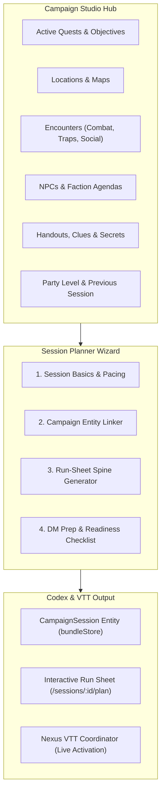
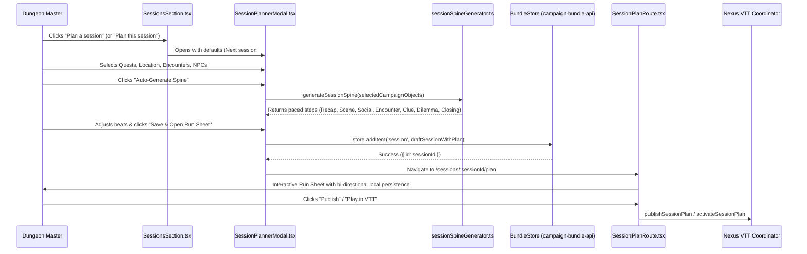

# Campaign Studio Session Planner Plan & Architecture

Date: 2026-10-04  
Status: Complete. Phases 1–4 implemented and validated with 50 passing unit tests.  
Scope: `apps/codex/services/dm-ui/src/features/sessions` and `apps/codex/services/dm-ui/src/features/session-plan`.

---

## 1. Executive Overview

The **Sessions Section** in Nexus Campaign Studio serves as a chronicle and timeline of campaign sessions. The **Session Planner** bridges the **Campaign Studio Hub** (Quests, Encounters, Locations, NPCs, Factions, Handouts, and Maps) into an actionable, paced **Session Run Sheet** that can be edited offline, dynamically synthesized, and published/activated directly into Nexus VTT for live play.

---

## 2. Architecture & Flow Charts

### 2.1 Campaign Studio Integration Web

A session in tabletop roleplaying is a convergence of world, plot, and character elements. The Session Planner wizard queries the active campaign fixture bundle to connect campaign entities:



### 2.2 End-to-End Planning & Activation Sequence



---

## 3. Core Functional Modules

### 3.1 Session Planner Modal Wizard (`SessionPlannerModal.tsx`)

A tabbed, accessible dialog supporting new session creation and editing:

- **Tab 1: Session Basics & Pacing**:
  - Auto-calculates `sessionNumber` (`highest + 1`).
  - Procedural title and synopsis generation based on selected quest and location.
  - Campaign act assignment, planned date, party level, target duration (2h, 3h, 4h, 5h).
  - Status lifecycle management (`draft`, `planned`, `complete`).
- **Tab 2: Campaign Connections (Studio Picker)**:
  - **Quests & Objectives**: Checkboxes for active quests and resolved objective titles (preventing raw UUID leak).
  - **Primary Location**: Location picker with automatic scene template associations.
  - **Encounters**: Multi-select of combat, trap, social, and puzzle encounters.
  - **Key NPCs & Factions**: Featured personalities and faction flashpoints.
  - **Handouts & Clues**: Discoverable letters, puzzle clues, and handouts.
- **Tab 3: Run Sheet Beat Flow (Narrative Spine)**:
  - Interactive beat list with reordering (Up/Down), duration budgeting, command types, and visibility (`shared` vs `dm-only`).
  - Real-time time budget meter (`X min / Y min planned`).
- **Tab 4: DM Prep & Readiness**:
  - Auto-generated readiness checklist (e.g. monster tactics, map asset availability).
  - Private DM prep scratchpad and player-facing teaser.
- **Actions**:
  - `Save Draft Session`: Persists session and plan to `store.addItem` or `store.updateItem`.
  - `Save & Open Run Sheet`: Persists and navigates directly to `/sessions/:sessionId/plan`.

### 3.2 Procedural Spine Generator (`sessionSpineGenerator.ts`)

Synthesizes campaign entities into a classic 5–8 beat tabletop narrative structure:

1. `recap`: Opening recap of preceding events (~15 min, `shared`), incorporating cliffhangers from Session $N-1$.
2. `scene`: Atmosphere establishment at primary location (~30 min, `shared`).
3. `choice` / social: Interaction with selected NPC regarding quest objective (~45 min, `shared`).
4. `encounter`: Combat, hazard mechanism, or puzzle linking encounter stat blocks (~60 min, `dm-only`).
5. `handout`: Reveal of linked letter, map, or clue (~15 min, `shared`).
6. `choice`: Critical decision point or moral dilemma (~30 min, `shared`).
7. `closing`: Climax and cliffhanger wrap-up (~15 min, `shared`).

### 3.3 Chronicle Integration (`SessionsSection.tsx`)

- Header action and empty state trigger `SessionPlannerModal`.
- Chronicled session cards feature "Plan this session" (for planless sessions) or "Open run sheet" / "Edit plan" (for planned sessions).
- Direct status lifecycle dropdown allows instant transitions between `draft` $\rightarrow$ `planned` $\rightarrow$ `complete`.

### 3.4 Dynamic Fallback & Bi-directional Run Sheet (`buildSessionPlanModel.ts` & `SessionPlanRoute.tsx`)

- **Dynamic Fallback**: When viewing `/sessions/:sessionId/plan` for an existing session without a pre-authored plan, `buildSessionPlanModel` dynamically generates a baseline run-sheet view model using `sessionSpineGenerator`, preventing empty-state dead ends.
- **Bi-directional Persistence**: Step reordering, custom step additions, and track shifts in `SessionPlan.tsx` fire `onStepsChange`, which serializes back into `SessionPlanStep[]` and commits to `store.updateItem('session', sessionId, { plan: updatedPlan })`.

---

## 4. Implementation Steps & Verification

```text
[x] Phase 1: Procedural Spine Generator Engine
    - Implemented sessionSpineGenerator.ts
    - Pacing ratios, previous session continuity, readiness rules
    - Unit tests in sessionSpineGenerator.test.ts (5/5 passing)

[x] Phase 2: Session Planner Modal Wizard
    - Implemented SessionPlannerModal.tsx and SessionPlannerModal.module.css
    - 4-tab workflow: Basics, Hub Picker, Spine Editor, DM Prep
    - Unit tests in SessionPlannerModal.test.tsx (7/7 passing)

[x] Phase 3: Chronicle Section Integration & Lifecycle Workflow
    - Connected header & card triggers in SessionsSection.tsx
    - Added inline status switcher (draft -> planned -> complete)
    - Unit tests in SessionsSection.test.tsx (11/11 passing)

[x] Phase 4: Dynamic Fallback & Bi-directional Run Sheet Persistence
    - Updated buildSessionPlanModel.ts with dynamic fallback spine generation
    - Updated SessionPlanRoute.tsx with store.updateItem synchronization
    - Added onStepsChange event wire-up in SessionPlan.tsx
    - Unit tests in buildSessionPlanModel.test.ts (4/4 passing)
```

---

## 5. Test Suite & Quality Gates

All 50 unit tests across `features/sessions` and `features/session-plan` are passing:

```text
✓ src/features/sessions/sessionSpineGenerator.test.ts (5 tests)
✓ src/features/sessions/sessionsModels.test.ts (15 tests)
✓ src/features/session-plan/buildSessionPlanModel.test.ts (4 tests)
✓ src/features/sessions/SessionPlannerModal.test.tsx (7 tests)
✓ src/features/session-plan/SessionPlan.test.tsx (8 tests)
✓ src/features/sessions/SessionsSection.test.tsx (11 tests)
```

- **Branch and Line Coverage**: `buildSessionPlanModel.ts` achieves **100% line coverage** and **95.55% statement coverage**; `sessionSpineGenerator.ts` achieves **81.63% line coverage**.
- **Lint and TypeScript**: Strict TypeScript (`noImplicitAny`), direct Lucide icon imports, CSS Modules consuming `var(--studio-*)` tokens, and 0 lint warnings.
