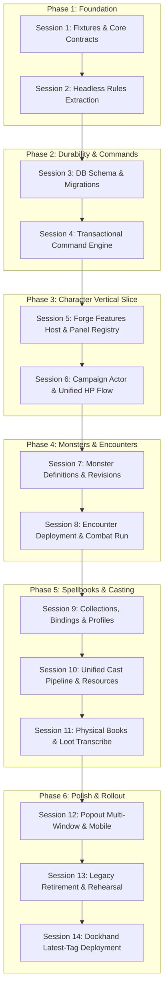

# Forge and VTT object integration plan

Date: 2026-09-25  
Status: Implemented and Verified (Phases 1 through 6 complete).  
Planning baseline: checkout `2a42cf28`, including the existing shared creator.  
Deployment convention: the Dockhand Compose file uses `:latest` for frontend and backend. Preserve this convention.

Paths in this document are relative to the repository root. Proposed names are
identified as such; current implementation findings are listed separately.

## 1. Intended experience

Nexus Forge authors reusable characters, monsters, encounters, and spellbooks.
Nexus VTT brings them into a campaign and makes them available from the sheet,
map, initiative tracker, inventory, chat, and spellcasting controls. Standalone
Forge and the VTT use the same feature components and rules, with explicit
storage and campaign context supplied by their host.

The integration is complete when these workflows work through ordinary UI:

1. Build a character in Forge, add it to a campaign, assign its controller, and
   place its token. Changing HP from its sheet updates initiative and every
   linked token. Reloading either application restores the committed state.
2. Build a monster and a reusable encounter containing several copies. Deploy
   it to a scene with placement previews, then start combat. Each creature has
   independent HP, conditions, actions, and resources. Reusing the encounter
   produces fresh creatures without altering the source monster.
3. Build a spell collection, attach it to a character's appropriate casting
   source, preview eligible preparations, and apply them at an allowed time.
   Cast through the sheet, spellbook, action bar, or token menu and receive the
   same resource accounting, roll, chat card, and effect state.
4. Award a physical grimoire as loot. Its contents can be inspected, annotated,
   copied under the applicable rules, transferred, and referenced in Codex.
   Possession, knowledge, preparation, and permission to cast remain distinct.
5. Pop out a character sheet or spellbook while the main window shows combat.
   Closing or redocking it retains its selected object, draft, and live state.

The first useful release delivers workflows 1 and 2 plus a linked, read-only
spell view. The spellbook release delivers 3 and 4. Advanced effects and creative
extensions follow on the same contracts.

## 2. Review of the earlier proposal

The definition/instance distinction and native panel approach are sound. Several
details need correction before implementation:

| Current finding                                                                                                                          | Consequence for this plan                                                                                                      |
| ---------------------------------------------------------------------------------------------------------------------------------------- | ------------------------------------------------------------------------------------------------------------------------------ |
| `packages/character-contracts` already defines Character, Spellcasting, Equipment, Mob, and import contracts.                            | Extend and adapt existing contracts. Avoid introducing a competing character model.                                            |
| `packages/character-creator` owns the shared wizard and `toNexusCharacter()`.                                                            | Preserve the single wizard and conversion entry point described in ADR-0002.                                                   |
| Forge monster and encounter types currently come through the creator's `types/dnd.ts`.                                                   | Move headless domain types to an appropriate shared contract package incrementally, with re-export compatibility.              |
| `apps/forge/src/services/storage/VttSocketAdapter.ts` returns empty results or apparent success for several unsupported operations.      | Replace these paths with typed host capabilities and real repositories. An unavailable write must return a typed failure.      |
| Forge's `dbService.ts` selects its adapter through a mutable module singleton.                                                           | Inject repositories per React host/provider so standalone, campaign, and preview contexts cannot switch one another's storage. |
| `SpellbookEntry` contains both `characterId` and `preparedSpells`; the character also has `spellcasting.preparedSpells`.                 | Make collection membership and proposed loadouts separate from the character's actual preparation state.                       |
| `SpellbookManager` receives `selectedCharacter`, but its storage operations still manage independent collections.                        | A character label or foreign key alone does not implement class validation, shared slots, or casting.                          |
| Forge `Encounter` mixes `monsterIds` and optional `combatState`.                                                                         | Migrate to an encounter template and a separate encounter run; preserve resumable legacy combats.                              |
| VTT already links tokens and initiative to `characterId`, but stores HP in several places. `characterSyncService.syncStats()` is a stub. | Treat those surfaces as projections of one campaign actor and migrate their write paths to commands.                           |
| The database creates `characters.id`, while creation code keeps the embedded character ID without reconciling the response.              | Build an explicit legacy ID map before introducing campaign references. Never infer identity from a display name.              |
| `CharacterHandler` relays character events without ownership validation; combat checks use client-supplied fields in places.             | Validate authenticated identity and persisted permissions before accepting domain mutations.                                   |
| `SessionRepository.commitGameState()` and the event journal own separate transactions today.                                             | Introduce a shared transaction boundary for commands that change actors, room state, and events together.                      |
| The VTT has both a local generic `EntityStore` and an image-oriented Atlas library.                                                      | Reuse relevant presentation patterns, while keeping server authority and structured gameplay objects explicit.                 |
| `WindowPortal` prefers Document Picture-in-Picture, and floating/docked branches can remount their children.                             | Add a multi-window policy and preserve edit state outside the panel mount. Popout is not automatically state-preserving.       |

An account character should have one identity within its account, and a campaign
character should have one identity within its campaign. Separate campaigns need
independent progress, inventory, HP, and spell resources. The earlier suggestion
of one character object everywhere needs this scope qualification.

## 3. Object model and ownership

### 3.1 Shared identity and references

Introduce a small `@nexus/game-contracts` package for cross-application objects.
It imports existing character contracts and owns the new IDs, references,
runtime schemas, command payloads, and projections. Use discriminated unions
and the repository's existing validation tooling; TypeScript alone is not a
validation boundary.

Every authored record carries:

- Stable UUID, object kind, owner, optional campaign scope, and schema version.
- Revision, creation/update timestamps, archive status, and source provenance.
- Ruleset identity, including edition and content/rules revision.
- Search metadata such as name, tags, and an optional portrait/token asset ref.
- Explicit permissions. Library visibility and campaign play permissions are
  different concepts.

Separate `schemaVersion` (serialization), `revision` (authored content),
`stateVersion` (mutable gameplay), and the existing room hash/version chain.
An official spell slug is only unique within its source pack and ruleset.
Resolve legacy slugs through a catalog key containing all three values.

Cross-object links use typed references, for example:

```ts
interface DefinitionRef<K extends DefinitionKind> {
  kind: K;
  id: string;
  revision: number;
}

interface RulesetRef {
  system: 'dnd5e';
  edition: '2014' | '2024';
  contentPackId: string;
  contentRevision: string;
  rulesRevision: string;
}
```

Campaign use pins a definition revision and stores a validated snapshot of its
required content. This preserves play after a source is edited, archived, or
unavailable. Updating to a newer revision is an explicit preview-and-apply
operation that preserves runtime values by policy. It never silently heals a
creature, replenishes charges, or replaces player choices.

### 3.2 Definitions, campaign objects, and views

| Proposed object                        | Purpose and state owner                                                                                                 | Main consumers                                   |
| -------------------------------------- | ----------------------------------------------------------------------------------------------------------------------- | ------------------------------------------------ |
| `CharacterRecord`                      | Existing account character, with versioned authored choices and build data. Existing `characters` row remains the root. | Forge, dashboard, campaign admission, export     |
| `CampaignActor`                        | Campaign-owned PC, NPC, companion, or monster. Holds build snapshot/overrides, controller grants, and gameplay state.   | Sheets, tokens, combat, inventory, casting       |
| `MonsterDefinition`                    | Reusable stat block, actions, senses, image refs, and casting grants. Adapts existing Monster/UserMonster/Mob data.     | Bestiary, encounter builder, summons             |
| `EncounterTemplate`                    | Groups of definition refs, counts, overrides, optional placements, waves, and reward references.                        | Forge and VTT encounter preparation              |
| `EncounterRun`                         | A deployment of a template: participant actor IDs, stage, initiative, turn cursor, and resolution history.              | Initiative and encounter controls                |
| `SpellDefinition`                      | Versioned rules text plus optional validated structured casting/effect data.                                            | Spellbook, sheet, action resolver, chat          |
| `SpellCollection`                      | Ordered spell references and annotations, optionally themed or filtered.                                                | Library, preparation planning, study, NPC design |
| `SpellbookBinding`                     | Connects a collection or physical book to a particular actor and casting profile for a declared purpose.                | Spellbook and class-aware spell view             |
| `PreparationPlan`                      | A proposed named selection for one or more casting profiles. Applying it is a validated command.                        | Rest and preparation UI                          |
| `ItemDefinition` / `ItemInstance`      | Reusable equipment versus a particular owned item with charges, attunement, and optional book contents.                 | Inventory, loot, casting, transfer               |
| `SpellcastingProfile` / `ResourcePool` | Per-source spell eligibility and per-actor consumable resources.                                                        | All player and monster casting controls          |
| `CastRecord` / `EffectInstance`        | Accepted cast and its linked effects, duration, concentration, and resolution history.                                  | Chat, combat, map overlays, audit/recovery       |

Use a shared actor envelope with a discriminated PC/monster payload. Preserve
monster-specific recharge actions, legendary resources, multiple speeds, and
stat-block text rather than flattening monsters into incomplete PC sheets.

Keep actor references explicit as `campaignActorId`. Existing event contracts
use `actorId` for the acting client/user; do not overload that field with a
creature ID.

### 3.3 Ownership rules

1. Adding an account character to a campaign creates or selects a campaign
   actor linked to its source revision. A repeated admission command selects
   the existing branch; making a second branch is a separate action.
2. Opening that actor in Forge edits the same campaign object through the
   campaign API. Opening its account record edits the personal source. Display
   the selected campaign scope next to the character name.
3. Campaign progress does not automatically overwrite the account source.
   Provide an explicit "Save progression to library" comparison with expected
   revision checking. HP and consumed resources stay out of build publication.
4. Several tokens may reference one actor, but their scene position, visibility,
   light, and scale belong to token placements. Independent creatures always
   have independent actor IDs, even when they share one monster definition.
5. Initiative entries reference actors and store turn/order state. Character
   HP, conditions, inventory, slots, and concentration remain actor state.
6. During the initial release, one actor can belong to one active play session
   at a time, enforced transactionally. A second simultaneous game needs a
   deliberate campaign branch. Hibernation and resume retain the binding;
   explicit session close/reassignment releases it.
7. Archive authored content and retain referenced revisions. Report dependents
   before deletion and preserve broken legacy references for repair.

## 4. Character and monster integration across the VTT

| Surface                       | Character behavior                                                                                   | Monster/encounter behavior                                                                           | Spellbook connection                                                                          |
| ----------------------------- | ---------------------------------------------------------------------------------------------------- | ---------------------------------------------------------------------------------------------------- | --------------------------------------------------------------------------------------------- |
| Account dashboard and lobby   | Select a personal character, campaign branch, and controller; show migration/sync state.             | DM selects campaign bestiary and prepared encounters.                                                | Open personal collections or a character's bound books.                                       |
| Creator and advancement       | Shared wizard; preview build changes and recalculate dependent stats without resetting HP/resources. | Custom monster editor preserves full stat-block data and revision history.                           | Revalidate bindings and preparation after a class/level change.                               |
| Character panel and sheet     | Full Forge sheet plus campaign commands; sheet can open from any actor link.                         | Actor-specific stat block with current HP and limited-use actions.                                   | One shared spellcasting view embedded in sheet or separate pane.                              |
| Scene placement and token HUD | Drag actor to create a linked token; portrait/size/vision defaults; choose active representation.    | Encounter placement preview creates independent actors and tokens; hidden placement remains DM-only. | Cast from the selected actor; choose a valid origin token when more than one exists.          |
| Initiative and turn controls  | Linked HP, conditions, death saves, resources, concentration, and sheet opener.                      | Individual/group initiative policy, recharge checks, waves, and legendary-action counters.           | Show available actions and existing concentration without duplicating resources.              |
| Dice and chat                 | Ability/skill/save/attack commands calculate from the actor; chat names the source.                  | Clickable actions from the pinned monster snapshot.                                                  | Cast cards identify source profile, resource, spell revision, and targets.                    |
| Action bar and shortcuts      | Pin actor action references; resolve current values when activated.                                  | Pin actions on a specific creature or reusable definition shortcut.                                  | Pin a spell grant, so the selected casting source remains unambiguous.                        |
| Map templates and effects     | Actor-linked range and area previews use scene units.                                                | Encounter placements support relative offsets and waves.                                             | Approved structured spells suggest existing drawing shapes; link them to a cast/effect.       |
| Inventory and loot            | Item-instance ownership, equip/attune, quantity, currency, and transfer commands.                    | Monster/encounter loot references; award once with an idempotent command.                            | Physical books and scrolls are items; reading, copying, and consuming use different commands. |
| Rests and recovery            | Preview HP, hit dice, class resources, and preparation changes using the pinned ruleset.             | Encounter reset creates fresh instances; ongoing NPC recovery follows its resource policy.           | Apply valid preparation plans; refresh each resource pool by its own rule.                    |
| NPCs, companions, summons     | Assign permitted controllers and ownership links; preserve parent actor references.                  | Summons are actor instances; duration/despawn links to their originating effect.                     | Shared cast pipeline supports monster innate/limited-use spell sources.                       |
| Search and library            | Filter personal/campaign records; open references in their scope.                                    | Find monsters, templates, and deployed runs distinctly.                                              | Search spell content, books, plans, and sources with edition filters.                         |
| Codex and documents           | Link biographies, journal entries, and character notes through existing document refs.               | Link stat-block lore and encounter notes; preserve DM visibility.                                    | Link book covers, page handouts, and readable excerpts.                                       |
| Sharing, import, and export   | Export source or campaign snapshot explicitly, with provenance and schema version.                   | Export definitions or templates with a dependency manifest.                                          | Export collections/bindings as permitted; exclude another actor's private state.              |
| Mobile and popouts            | Same commands and selected actor; phone view uses a full-screen focused tool.                        | Compact encounter roster and stat-block view.                                                        | Session spell list and preparation editor adapt to available width.                           |

Use an object picker and command menu everywhere drag/drop is available, for
keyboard, touch, and cross-window workflows. Dropping a definition on a map
creates an instance; dropping an existing campaign actor creates a placement.
The preview must make that distinction visible.

### 4.1 Encounter launch lifecycle

Represent groups with stable entry IDs, monster refs, count, faction, per-group
overrides, and optional relative placements. Preserve authored ordering.
Allow encounter templates to include existing campaign actor refs when they
are campaign-scoped, with explicit "reuse actor" behavior.

1. Resolve all definitions and assets; show missing content, edition conflicts,
   limits, and party assumptions before placement. Difficulty calculations are
   edition-specific estimates, not guarantees of encounter balance.
2. Create a deployment preview at a chosen scene anchor. Token sizes, occupied
   spaces, waves, visibility, and initiative grouping can be adjusted.
3. `DeployEncounter` commits the run, actor instances, and initial placements
   together. Its command ID prevents duplicate deployments after a retry.
4. `StartEncounter` adds selected participants to initiative without respawning
   tokens. Separate this from deployment so DMs can stage a scene in advance.
5. `ActivateWave`, damage, conditions, recharge, and actor actions use the same
   command path as PCs. Record where any DM override was applied.
6. Ending combat retains surviving campaign actors and resolved outcomes.
   Removing placements, archiving creatures, awarding loot, and starting a
   fresh run are explicit operations.

A monster build may offer a spell collection as part of its definition, but its
casting behavior is expressed as grants and resource policies. Monster spell
use must not assume PC class levels or ordinary spell slots.

## 5. Spellbooks as extensible objects

### 5.1 Separate content, relationship, and permission

Use composition so a book can support multiple useful roles without creating
one unrelated model for every feature:

| Layer                            | Owns                                                                                                               | Does not imply                                               |
| -------------------------------- | ------------------------------------------------------------------------------------------------------------------ | ------------------------------------------------------------ |
| `SpellCollection`                | Spell entries, ordering, tags, annotations, content revision.                                                      | Knowing, preparing, or being allowed to cast those spells.   |
| `ItemInstance` with book content | A particular physical copy, holder, transcription changes, condition, and item-specific grants.                    | Automatic learning or shared charges with other copies.      |
| `SpellbookBinding`               | Actor, casting profile, referenced source, and purposes such as study, preparation source, reference, or item use. | Extra preparation capacity or unrestricted class access.     |
| `SpellGrant`                     | Why this actor can use a spell, applicable ability/DC policy, eligible modes, and cost/recovery rules.             | An independent slot pool for each UI view.                   |
| `PreparationPlan`                | A proposed selection with its intended profiles and source refs.                                                   | Changing current prepared state until validated and applied. |

A physical copy pins its original collection content and has its own revisioned
additions and annotations. Editing a library collection does not rewrite books
already awarded as loot. Transferring an item transfers that physical copy;
copying its permitted contents creates a separate record.

### 5.2 Per-class and per-source casting profiles

Replace the single-source assumptions of the legacy `Character.spellcasting`
with additive actor spellcasting contracts. Migrate the existing data into one
profile initially; expose legacy read projections while callers move over.

Each profile records:

- Stable profile ID; class/subclass, feat, species, item, or monster-feature
  source; source level where applicable; pinned ruleset.
- Spell selection and replacement policy, ability, DC/attack calculation
  policy, eligible lists, always-available grants, and ritual policy.
- Known/learned membership, prepared grant IDs, linked books, and preparation
  limits. Only this profile owns its actual preparation state.
- References to actor resource pools and feature/item use counters. Multiclass
  profiles may consume a shared pool while retaining different abilities and
  spell eligibility. Pact resources remain separately represented.

Multiple grants for the same spell remain distinct when their casting ability,
cost, or source differs. The UI can group the spell visually and offer valid
casting sources. Never deduplicate grants solely by spell slug.

Class behavior is data-driven and tested by ruleset. In particular, the 2024
use of the word "prepared" does not mean that every class can freely replace
its entire list after any rest. Wizard book access and class features also
affect available operations. See the official
[2024 class rules](https://www.dndbeyond.com/sources/dnd/br-2024/character-classes).

Multiclass eligibility and available slots are separate calculations: a larger
slot does not automatically permit learning a higher-level spell from another
class. Preserve each source's spellcasting ability and selection rules. See
the official [2014 multiclass rules](https://www.dndbeyond.com/sources/dnd/basic-rules-2014/customization-options).

| Caster/source                     | Useful book experience                                                                                      | Policy that must be encoded                                                                                                     |
| --------------------------------- | ----------------------------------------------------------------------------------------------------------- | ------------------------------------------------------------------------------------------------------------------------------- |
| Wizard                            | Personal grimoire, book access, transcription queue, backups, ritual view, preparation plans.               | Learned spells, accessible book contents, preparation timing/capacity, and copying rules by edition/feature.                    |
| Cleric and Druid                  | Prayer/nature collections, themed preparation plans, always-available spells, party-role filters.           | Available class lists, granted spells, replacement windows, and capacity rules. Physical-book flavor alone adds no restriction. |
| Bard and Sorcerer                 | Repertoire collections, favorites, situational sets, advancement choices, feature-specific casting options. | Edition-specific selection/replacement; a collection cannot grant arbitrary spell swaps.                                        |
| Paladin and Ranger                | Combat/exploration sets, concentration reminders, relevant feature actions.                                 | Edition-specific progression and preparation/replacement; half-caster rules remain source-aware.                                |
| Warlock                           | Pact grimoire view, invocations, separate pact resources, limited-use spells.                               | Pact recovery, source-specific grants, and features that do not spend ordinary slots.                                           |
| Casting subclasses and multiclass | Tabs by source with a combined session view.                                                                | Class-level eligibility, subclass exceptions, ability/DC selection, and shared versus separate pools.                           |
| Feat/species/item grants          | Spells annotated with their origin and available costs.                                                     | Free-use limits, recharge timing, alternate slot use where permitted, item attunement and ownership.                            |
| Monster/NPC casting               | Stat-block repertoire with at-will, recharge, or limited-use controls.                                      | Explicit monster resource policy; manual resolution when imported text is not structured.                                       |

### 5.3 Typed capabilities and host interfaces

Begin with a finite, versioned capability registry. Add a capability only when
a concrete feature needs it. Use safe, validated data and registered handlers;
imported book JSON cannot contain executable JavaScript.

Proposed capabilities: reference, preparation source, transcription source,
ritual source, spell grant, charges, annotations, and linked document pages.
Capabilities compose, but their presence is still subject to actor rules and
server authorization.

The shared spellbook UI consumes ports with these responsibilities:

- `SpellCatalog.resolve(ref)` returns the pinned definition or an explicit
  unresolved result, with edition/source information.
- `SpellbookRepository.get/subscribe/saveDraft` handles revisioned content.
- `SpellcastingRules.evaluate(context, operation)` returns eligibility,
  reasons, available source/cost choices, and the rules revision used.
- `CampaignCommands.preview/execute` performs preparation, transcription,
  transfer, casting, and effect operations with expected versions.
- `ObjectNavigator.open(ref)` and `SceneActions.previewArea(...)` connect the
  same book to sheets, Codex, and map interaction without importing VTT stores.

Rule evaluation returns structured reason codes such as wrong edition, missing
source access, insufficient capacity, unavailable replacement window, resource
exhausted, or manual resolution required. The UI displays an actionable reason.
The server repeats eligibility checks when executing; a client preview never
authorizes a mutation.

### 5.4 Useful and creative features

| Feature                      | User interaction                                                                                                 | Stage and dependency                                                       |
| ---------------------------- | ---------------------------------------------------------------------------------------------------------------- | -------------------------------------------------------------------------- |
| Character-bound session book | Open one list of currently usable spells with source choice, slots, rituals, and concentration.                  | Core spellbook release; profiles and command path.                         |
| Named preparation plans      | Save "Underground expedition" or "Negotiation"; preview additions/removals and apply at a valid time.            | Core; preparation policies and rest context.                               |
| Study and transcription      | Queue discoveries, preview time/material costs and eligibility, record progress, and finish a copy.              | Physical-book release; inventory, currency, campaign time.                 |
| Lootable annotated grimoire  | DM reveals selected pages; players add permitted notes, transfer the book, and copy eligible spells.             | Physical-book release; page permissions and document refs.                 |
| Backup or borrowed spellbook | Track physical access separately from learned knowledge; make another copy through the same rules.               | Physical-book release; per-copy content and access policy.                 |
| Party preparation board      | Show shared role coverage such as healing, exploration, and control; let each player apply their own legal plan. | Extension; explicit opt-in visibility and book bindings.                   |
| Encounter mage kit           | Attach a reusable repertoire to a monster build, then customize a spawned caster's resource budget.              | Extension; monster grants and definition revisions.                        |
| Contextual spell suggestions | Filter by range, action timing, available resources, and visible targets; explain why a spell appears.           | Extension; structured data and scene context; no hidden-target disclosure. |
| Research journal             | Link spells to discovered pages, experiments, and campaign notes; track DM-approved homebrew versions.           | Extension; Codex refs and explicit house-rule policy.                      |
| Themed presentation          | Prayer book, song repertoire, field notes, or arcane grimoire using the same collections and controls.           | Presentation extension; no implied mechanical benefit.                     |

Applying a plan offers an explicit replace/merge preview. Illegal selections
stay visible with reasons; do not silently discard them or overfill capacity.
Rules-supported always-prepared grants remain intact. When class levels or
equipment change, flag invalid bindings and ask for the applicable in-product
resolution instead of silently granting or removing unrelated spells.

### 5.5 Casting lifecycle

1. **Select:** choose actor, spell grant/source, casting mode, optional upcast,
   resource pool, and targets. The same operation is used from all entry points.
2. **Preview:** calculate costs, legal targets/range where implemented, action
   requirements, concentration replacement, and supported effects. Map area
   previews are transient and spend nothing.
3. **Commit:** `CastSpell` verifies controller permissions, actor/resource/item
   versions, source access, and rules. Persist a cast ID, charge expenditure,
   concentration transition when applicable, event, and any immediate effects
   in one transaction. Retries return the saved result without charging twice.
4. **Resolve:** reuse authoritative dice generation for supported attacks/saves.
   Persist results under the cast ID. Apply damage, healing, or conditions as
   validated, idempotent resolution commands; some casts require reactions or
   DM adjudication and cannot resolve in one click.
5. **Maintain:** track duration by campaign time or the appropriate turn/round
   anchor. Concentration links effects, templates, and summons to one source.
6. **End or correct:** ending concentration removes its dependent effects by
   policy. A correction is an audited compensating command. It checks later
   dependent actions before offering any refund; cancelling a preview has no
   cost, while cancelling an accepted cast follows rules/DM adjudication.

Use an explicit cast state machine for non-instantaneous casting and reaction
windows: draft, started, awaiting resolution, resolved, interrupted, or corrected.
Policies determine when a particular cost is paid and when concentration begins;
starting a long casting process must not blindly reuse the completion behavior
of an immediate spell. Validate action/bonus-action/reaction use and per-turn
casting restrictions against the edition and features. Effects specify their
own expiry anchor, such as the start of the source's next turn, rather than
decrementing every condition whenever any combatant advances.

Resource expenditure is keyed by actor pool and command ID, not by panel or
spellbook. Unsupported prose-only spell effects remain usable as reference and
manual resolution. Record an automation coverage level per spell/action so the
UI never suggests that all SRD text has executable semantics.

## 6. Persistence, authorization, and synchronization

### 6.1 Storage ownership

Keep PostgreSQL in the existing VTT backend as the persistence authority for
account and campaign objects. Standalone Forge supports local drafts and
offline authoring through IndexedDB, and uses the same authenticated API when
the user opens account or campaign scope.

Proposed additive tables, refined through migration review (see detailed schema definitions and interaction diagrams in [Object models, database tables, and application data flow](../object-models-and-data-flow.md)):

| Table/group                                                            | Stored data and constraints                                                                                                        |
| ---------------------------------------------------------------------- | ---------------------------------------------------------------------------------------------------------------------------------- |
| Existing `characters` plus `character_revisions`                       | Preserve existing account IDs; add optimistic versioning, schema/provenance, and build revision history.                           |
| `library_objects`, `library_object_revisions`, `library_object_grants` | Typed monster, encounter, spell, collection, and item definitions; immutable revisions; indexed owner/campaign/kind; grant checks. |
| `campaign_actors`                                                      | Campaign actor ID, source revision, controller grants, full build/runtime aggregate, version, and optional active session binding. |
| `encounter_runs`                                                       | Template revision, stage, actor participation, deployment command ID, and active session.                                          |
| `domain_command_receipts`                                              | Idempotency key, principal, scope, payload hash, committed result, and retention metadata.                                         |
| `legacy_object_ids`                                                    | Owner/source namespace + old ID to canonical ID; migration version and checksum.                                                   |
| Existing sessions and event tables                                     | Public room projection, hash/version anchors, journal, and entity version preconditions, extended transactionally.                 |

Initially keep actor inventory, book bindings, profiles, pools, effects, and
physical-item state inside the validated actor aggregate. This gives one CAS
version for resource changes. Unowned loot lives in a revisioned campaign
container aggregate; transfers lock the source and destination together.
Normalize these children into additional tables only when query/concurrency
requirements justify it. Keep token positions in existing scene state.

The account source and campaign actor serve different lifecycles. The
`campaign_actors` row is the durable campaign record across session closure;
`sessions.gameState` is its committed play projection. The projection must
never become a second independently writable actor record.

### 6.2 Command transaction boundary

Introduce a domain command service in the existing server. Both REST and socket
entry points call it. A command envelope contains a command ID, target scope,
typed payload, expected object versions, and protocol version. The server
derives the user identity from the authenticated connection.

For an active-room mutation:

1. Validate payload/schema, authenticate, load permissions and the actor's
   active-session binding, and check the idempotency receipt.
2. Lock affected rows in a consistent order. Check all expected object versions
   and the room token/version; calculate the next state from committed data.
3. In one PostgreSQL transaction update actor/container/run aggregates, append
   the command result and ordered event, advance relevant entity versions, and
   call the transaction-aware `SessionRepository.commitGameState()` path for
   the room projection and both anchors.
4. Commit before ACK, in-memory authoritative updates, or peer publication.
   Redis remains fanout/presence, and reconnect recovers from PostgreSQL.
5. On conflict, roll back the whole unit and return committed versions/state.
   Rebase edits or retry only a still-valid command; never resubmit a stale
   snapshot over the winner. Duplicate IDs with different payloads are rejected.

This requires adding a transaction-client variant to the existing repositories;
calling the current independently committing methods sequentially is not
atomic. Keep the existing public wrapper for callers during migration. Account
and offline-campaign authoring use the same validation/receipt semantics without
inventing a room just to edit a library object.

The old full-snapshot and patch endpoints must reject or reconstruct migrated
actor fields from server state. They cannot remain an alternate write path that
bypasses ownership, inventory checks, or resource accounting. Gate older clients
into compatible read-only/reload behavior for upgraded campaigns.

State-neutral public projections retain their room version/hash as required by
the current durability contract. A private-only change can advance its object
version and restricted event stream without a fabricated public state change.
Retain command receipts independently of the bounded room journal, so journal
pruning cannot cause an old cast or loot award to execute twice.
Define receipt retention together with replay policy: after compacting a result,
retain its deduplication tombstone or reject commands outside a bounded validity
window. Expiring a receipt must never turn a previously committed command into
a new executable request.

### 6.3 Permissions and visibility

Resolve rights from the stored campaign membership/controller policy. Distinguish
view, control, edit build, edit definition, grant ownership, and DM adjudication.
Owning a character does not grant rights to mutate another creature's HP, and
viewing a spellbook does not grant rights to reveal its private pages.
Target changes from an attack or spell are authorized by the server's validated
combat resolution or explicit DM adjudication, distinct from granting the
caster unrestricted editing rights over the target.

Keep shared room snapshots safe for every recipient. Restricted actor details,
hidden monsters, private pages, unrevealed loot, and DM notes are fetched and
subscribed through authorized object views. Never send them and rely on CSS to
hide them. Public actions and chat cards contain only explicitly disclosed data.

The existing hash chain represents one shared projection. Do not redact a
different snapshot for each client while claiming the same hash/token. Use that
common safe projection plus restricted object updates with separate revisions.
Migrate any legacy private fields out of the shared projection before enabling
secret books or encounters, and test snapshots, journal replay, search results,
exports, and caches for disclosure.

Revocation stops subsequent subscriptions and access and invalidates local
restricted caches on the next connection. It cannot revoke knowledge of content
already legitimately viewed. Guest campaign controllers receive explicit scoped
grants; personal cloud libraries require an account.

### 6.4 Offline and multi-window behavior

Use `storageWorkerClient`/the existing Comlink storage worker for VTT persistence
and heavy migrations. Shared modules depend on storage ports rather than opening
IndexedDB directly. Cache keys include account, campaign, ruleset, and revision.

Offline users can read cached content and edit clearly marked local drafts.
Shared combat casts, loot transfers, and encounter deployment require a live
authoritative result. Save intent for review when disconnected rather than
showing a locally accepted cast that may conflict with another player's turn.
Library draft synchronization checks the base revision and presents conflicts;
it never overwrites a newer record solely because a timestamp is later.

Portal popouts use the host's in-memory stores. Independently opened Forge tabs
use the API and revision subscriptions/revalidation; shared origin and IndexedDB
alone do not synchronize live React state. BroadcastChannel may invalidate a
cache, but carries no authority to change gameplay.

## 7. Shared UI, packages, and panel behavior

Use the following dependency direction:

```text
character-contracts
        ^
  game-contracts <----- rules-5e (headless calculations/catalog adapters)
        ^                  ^
        +---- forge-features
                    ^
        Forge host / VTT host

character-creator -> contracts + rules-5e
VTT server        -> contracts + rules-5e
```

`@nexus/rules-5e` is a staged extraction of existing pure rules/data modules when
the server needs them. Preserve old re-exports and run parity fixtures. The
server must be able to validate a preparation/cast without importing React,
browser globals, CSS, or the entire creator bundle. Do not implement parallel
copies of existing calculators.

`@nexus/forge-features` begins with named entry points for bestiary, encounter,
character sheet, and spellbook. Hosts provide repositories, command/query ports,
navigation, rules context, and capabilities through a scoped provider. Preserve
the existing creator's persistence-free `CharacterCreationResult` contract.

Extend the existing panel system:

- Add a typed panel registry used by `GameUI`, `ContextPanel`, the launcher,
  and workspace persistence; avoid repeating IDs and widths in several files.
- Keep Characters, Bestiary/Encounters, and Spellbooks as the main tools.
  Individual actor sheets, monster stat blocks, and books can have panel
  instances `{ instanceId, kind, objectRef, context }` once multiple views land.
- Store selected object, draft edits, filters, and scroll restoration outside
  a component branch that unmounts on docking/popout. Reopening a panel is a
  view operation, not a database import.
- Supply modal/popover portal roots from the destination document. Use that
  document/window for focus, events, measurements, and shortcuts.
- Open external windows directly from user activation, detect blocking, and
  restore the panel on close. Support multiple ordinary popout windows; reserve
  Document PiP for one optional always-on-top tool. The
  [Document PiP specification](https://wicg.github.io/document-picture-in-picture/)
  defines a single last-opened PiP window per relevant window context.
- Preserve the dependency on the parent tab for portal popouts. Independent
  application windows are a separate API-backed mode, not assumed to survive
  closing the VTT automatically.
- Keep the creator/level-up workflow in an appropriately wide modal or
  full-screen view. Phone layouts use one focused tool at a time.
- Use CSS Modules and existing design tokens for new components. Isolate
  extracted Forge styles and existing creator styles; do not import Forge's
  global resets into the VTT. Use direct lucide component imports.

Lazy-load feature entry points, paginate/virtualize large catalogs, and move
bulk search indexing and migrations off the main thread. Existing Atlas assets
remain image/document assets; structured gameplay search can share its search
shell without masquerading every spell or encounter as an `AtlasAsset` image.

## 8. API and navigation contract

Proposed endpoint families use existing VTT authentication and backend routing:

| Endpoint/operation                                 | Behavior                                                                              |
| -------------------------------------------------- | ------------------------------------------------------------------------------------- |
| `GET /api/library/objects`                         | Authorized cursor-paginated search by scope, kind, ruleset, tags.                     |
| `GET /api/library/objects/:id/revisions/:revision` | Resolve a permitted immutable definition.                                             |
| `POST /api/library/commands`                       | Validated create/revise/archive/share/import operations.                              |
| Existing `/api/characters`                         | Compatibility facade for account characters; reconcile IDs and add expected versions. |
| `GET /api/campaigns/:id/actors`                    | Authorized campaign actor projections with filters/pagination.                        |
| `GET /api/campaigns/:id/actors/:actorId`           | Authorized actor detail, private fields only when permitted.                          |
| `POST /api/campaigns/:id/commands`                 | Typed campaign/encounter/preparation/cast/inventory commands.                         |
| Versioned socket command envelope                  | Same domain command handler and result semantics for an active room.                  |
| Restricted object subscription                     | Versioned invalidations/updates, reauthorized on subscribe and permission changes.    |

Examples of commands are `AdmitCharacter`, `ApplyBuildRevision`, `DeployEncounter`,
`StartEncounter`, `BindSpellbook`, `ApplyPreparationPlan`, `TranscribeSpell`,
`TransferItem`, `CastSpell`, `ResolveCast`, `ApplyDamage`, `RestActor`, and
`EndConcentration`. IDs and result shapes are typed; arbitrary remote store
patches are not the new API.

Creation returns canonical IDs and versions, which clients immediately adopt.
Conflict results include permitted current state and a retry policy. Unresolved
content, rule ineligibility, insufficient permissions, offline state, and
unsupported capabilities are distinct results.

Typed object links carry kind, ID, revision when applicable, and campaign scope.
The same ref opens a panel, a Forge route, or a Codex-linked view. URLs contain
no auth tokens or embedded private object payloads. Copying a link does not
change its access permissions.

## 9. Migration plan

Use expand/backfill/switch/contract migrations. Keep legacy reads and exports
available until parity checks and restore tests pass; new features initially
write through the new path only in opted-in campaigns.

1. Inventory legacy records: account row IDs, embedded character IDs, Forge
   local IDs, session links, token refs, initiative refs, and custom monster
   `id` versus catalog `index`. Scope mappings by account/source database.
2. Build deterministic ID mappings and idempotent migration receipts. Correct
   creation to adopt the canonical server ID. Replace name/content-based
   de-duplication for new writes with idempotency keys; preserve intentional
   twins and differently versioned builds.
3. Migrate account characters and campaign copies. When account and session
   state disagree, retain both snapshots and report the difference; do not
   pick a winner by name or most-recent browser cache time.
4. Map repeated `Encounter.monsterIds` to counted template entries while
   retaining order/provenance. Convert legacy combat state into a separate run
   with independent actor IDs and preserved HP/conditions, not a fresh launch.
5. Convert each legacy `SpellbookEntry` to a collection. Its `preparedSpells`
   becomes a proposed preparation plan. Preserve a valid character association
   as a binding candidate; never overwrite that character's existing actual
   preparations automatically.
6. Convert legacy character casting data into a profile and resource pools.
   Match spell slugs with source/edition. Mark ambiguous or unknown references
   unresolved, retain their original data, and provide a repair screen.
7. Treat `SpellbookDB` and Forge IndexedDB upgrades as resumable worker jobs.
   Browser-local data is only available on that origin/device: offer explicit
   import/export when it cannot be read from the current origin.
8. Migrate physical inventory entries to item instances as needed. Unique
   books/charged items get their own IDs; ordinary stackable equipment retains
   quantity semantics. Prevent stacking books with different contents.
9. Rebind token, player/session, initiative, panel, and deep-link references via
   the mapping. Validate missing/duplicate refs before changing writers.
10. Preserve source backups, checksums, and an import report until verified.
    Incompatible extension data remains available in export/quarantine rather
    than being silently dropped or trusted as executable rules.

Server backfills operate in bounded transactions. Migration fixtures cover
guest/local characters, already-imported records, duplicate display names,
missing editions, deleted definitions, partial imports, and interrupted resumes.

## 10. Delivery sequence and reviewable work units

Each stage ends with a working demonstration and its acceptance gate. Sizes are
relative engineering complexity, not calendar commitments: M is a focused
cross-module change; L requires several reviewable PRs. Re-estimate after the
first migration and command prototype.

| Stage | Depends on                             | Deliverable                                                                                  | Size |
| ----- | -------------------------------------- | -------------------------------------------------------------------------------------------- | ---- |
| P0    | None                                   | Contract decisions, representative fixtures, migration inventory.                            | M    |
| P1    | P0                                     | Shared IDs, references, domain schemas, compatibility adapters, headless rules boundary.     | L    |
| P2    | P1                                     | Versioned repositories, authorization, command transactions, privacy projections.            | L    |
| P3    | P1; live writes require P2             | Shared feature hosts and native panel registry.                                              | M    |
| P4    | P2, P3                                 | One campaign character across Forge, sheet, token, initiative, and rest.                     | L    |
| P5    | P2, P3; builds on P4 actor commands    | Monster definitions and encounter deployment through live combat.                            | L    |
| P6    | P4; P5 consumes same casting contracts | Bound spellbooks, profiles, preparation plans, core casting.                                 | L    |
| P7    | P5, P6                                 | Physical books, loot transfer, transcription, and linked effects.                            | L    |
| P8    | P4-P7                                  | Multi-instance windows, complete search/navigation, creative extensions.                     | L    |
| P9    | Every enabled stage                    | Migration rehearsal, reliability gates, latest-tag rollout, retirement of duplicate writers. | M/L  |

### P0. Establish executable examples and decisions

- Record the identity, campaign branch, snapshot, visibility, and resource-owner
  decisions as proposed ADRs alongside this plan.
- Capture fixtures for a martial PC, wizard in both editions, a multiclass
  caster with distinct abilities/pools, a feat/item spell grant, a noncaster,
  an innate caster monster, a custom monster, and a saved encounter mid-combat.
- Inventory actual rule coverage and unsupported mechanics. Define the initial
  automated spell/action fixture set; everything else keeps manual resolution.
- Record current creation/import, HP update, initiative, and spellbook behavior
  with focused characterization tests before changing their contracts.

Acceptance: each object has a documented owner and identity mapping; every
legacy fixture has an explicit expected conversion or unresolved result.

### P1. Contracts and reusable rules

- Add `packages/game-contracts` and staged `packages/rules-5e` extraction.
- Extend character contracts compatibly; export runtime schemas and pure
  adapters for monster/stat-block, actor, encounter, and spellbook objects.
- Preserve `toNexusCharacter()` and old Forge imports through re-exports.
- Add command/result unions, source-specific grants, resource pools, and
  explicit manual-resolution capabilities before UI binding work.
- Update workspace build order, path aliases, lockfile, Docker copy/build
  inputs, affected-project detection, and coverage inventories for new packages.

Acceptance: both apps still build; the server can import rules without browser
dependencies; conversion fixtures preserve source fields and edition identity.

### P2. Persistence and authoritative command foundation

- Add repository/schema migrations and ID reconciliation to existing account
  character creation and lookup paths.
- Implement grant checks and the command receipt/versioning mechanism.
- Extend `SessionRepository`, `EventJournalRepository`, and
  `GameStateCommitService` with one transaction for domain commands.
- Restrict legacy actor writes, define the public projection, and add scoped
  object reads/subscriptions. Replace pass-through character mutation relays.
- Implement one simple command such as `ApplyDamage` end to end before adding
  encounter deployment or casting. Prove it across two replicas and reconnect.

Acceptance: concurrent edits have one committed winner; denied users cannot
mutate/read restricted fields; a crash after ACK preserves the mutation; a
duplicate command cannot repeat its effect.

### P3. Native feature hosting

- Introduce `packages/forge-features` with contextual repositories and ports.
- Extract Bestiary and read-only Spellbook first; retain Forge's existing
  standalone behavior through its local host adapter.
- Add the panel registry and Forge tools to ordinary VTT navigation. Use the
  existing floating/docking system with responsive feature sizing.
- Replace `VttSocketAdapter` silent no-ops; explicitly disable unavailable
  commands until their corresponding stage is enabled.
- Prove isolated styling and portal document context before moving the full
  sheet and editor flows.

Acceptance: standalone Forge and VTT show the same catalog content; supported
saves persist; disabled operations are visible; dock/popout retains drafts.

### P4. Character workflow

- Implement admission, controller assignment, source update preview, and
  account/campaign scope selection.
- Replace sheet/token/initiative HP writes and `characterSyncService` feedback
  loops with actor commands and read projections.
- Bring the shared Forge sheet, inventory, advancement, and rest controls into
  the Characters panel; preserve pending inputs through network conflicts.
- Display the actor's authoritative spells read-only from its migrated profile
  before enabling the full preparation and casting workflows in P6.

Acceptance: create/import -> campaign -> token -> initiative -> damage -> rest
-> reload works for owner, DM, and observer with the appropriate permissions;
another campaign's branch is unchanged.

### P5. Monsters and encounters

- Implement custom monster revisioning and full stat-block fidelity.
- Extract encounter composition and connect deploy/start/wave/end commands.
- Reuse the VTT initiative and actor runtime for integrated play. Preserve
  standalone Forge's encounter UI as a local host of the shared rules; migrate
  its duplicated state ownership incrementally.
- Add per-instance resources, actor-linked token defaults, hidden previews,
  difficulty estimates, and linked stat-block actions.

Acceptance: deploy three copies of one custom monster, damage one, restart the
backend, and resume with all independent states intact. Deploying the template
again starts new creatures. Repeating the original command does not.

### P6. Spellbooks and class-aware casting

- Implement the collection/binding/profile distinction, preparation plans,
  eligible source lists, and class/edition-specific replacement policies.
- Add the shared session spell view to the sheet, Spellbooks panel, token menu,
  and pinned actions. Resources and preparations update through one command path.
- Implement preview/commit/resolve casting for the declared fixture set; use
  authoritative dice and persisted cast IDs. Support manual spell resolution.
- Add concentration state and recovery policies; support ordinary slots,
  separate pact resources, and limited-use grants through the same interfaces.

Acceptance: two panels casting against the last available slot cannot both
spend it; a duplicate request returns its cast record. Switching books does not
reset slots or preparations. Multiclass source selection uses the correct
ability and eligibility. Invalid plans explain why they cannot be applied.

### P7. Physical books and effect relationships

- Add owned book instances, annotations/pages, loot containers, transfer,
  transcription, costs/progress, and source-access checks.
- Link cast effects to existing map drawing types, conditions, concentration,
  and summon actors; support turn/time anchors and manual adjudication.
- Implement audited corrections and idempotent loot/reward assignment.
- Link Codex document refs without moving gameplay authority into Codex.

Acceptance: award -> inspect -> study/copy -> prepare -> cast -> transfer works;
each step respects actor rules and permissions. Ending an effect removes only
its linked dependents, and reloading does not duplicate items or costs.

### P8. Broader interaction and creative workflows

- Add panel instances for multiple sheets/books/stat blocks and reliable
  ordinary-window popouts plus the optional PiP tool.
- Add structured object search, command-palette actions, deep links, dependency
  previews, accessible drag/drop alternatives, and versioned bundle export.
- Deliver party preparation boards and encounter mage kits first among creative
  extensions; then source-aware contextual suggestions and research notebooks.
- Add companion/transformation workflows only with explicit actor-state and
  effect policies. Reusing a monster appearance must not overwrite the base PC.

Acceptance: every supported object opens from its relevant VTT references;
mobile/keyboard workflows remain usable; multiple views converge after edits.

### P9. Release and retirement

- Rehearse migration on a restored test database and browser fixture exports.
- Enable complete vertical workflows per campaign behind capability flags.
  Client and server capabilities must agree; retain a read-compatible fallback.
- Retire duplicate writable HP, preparation, inventory, and combat stores only
  after their callers use commands. Keep adapters for old exports as needed.
- Complete the rollout and recovery procedure below for every enabled stage.

Acceptance: the end-to-end scenarios in this document pass under the deployed
artifact set, and legacy data can be restored or exported without silent loss.

## 11. Verification and operational acceptance

### Rules, contracts, and migrations

- Round-trip fixtures retain character choices, custom monster traits/actions,
  source IDs, book contents, and item details. Unknown data is reported.
- Validate preparation/replacement per edition, per-class eligibility distinct
  from slot availability, duplicate spell grants, rituals, upcasting, pact
  pools, feature/item uses, and rest recovery. Unsupported rules are explicit.
- Verify references survive definition edits/archive; runtime HP/resources do
  not change when the source build is merely viewed or revised.
- Interrupt and rerun server/browser migrations; inspect counts, identity maps,
  checksums, and unresolved references. Same-name characters remain distinct.

### Transactions and multiplayer

- Race last-slot casting, damage, encounter deployment, item transfer, and
  preparation edits across replicas. Assert one valid result and no partial
  actor/room/event commit.
- Kill a backend after ACK and before peer publication, reconnect through a
  second replica, and verify actors, slots, cast records, and tokens survive.
- Replay after journal pruning and duplicate receipt submission; an operation
  already committed must not execute again.
- Test actor permissions, hostile IDs, spoofed owner fields, session reassignment,
  private views, hidden encounters, spellbook pages, and old-client writes.
- Run the existing managed E2E durability scenario and conflict-enabled soak
  whenever touching commit/reconnect behavior, including Redis interruption.

### UI and workflow verification

- Cover the five intended workflows with owner/DM/observer browser contexts.
- Verify popout/restore with unsaved drafts, blocked windows, destination
  document modals, themes, focus, hotkeys, parent close, and several windows.
- Check desktop and phone layouts with long names, large books, and missing
  assets. Test keyboard alternatives to drag/drop and touch selection.
- Ensure map templates use feet/grid conversion consistently; rendering stays
  in existing canvas layers and entity-anchored labels remain canvas-owned.
- Test local drafts, account login/logout, disconnected play, conflicting
  revisions, and independently opened Forge/VTT tabs.

Use Vitest for pure rules/adapters and focused components, PostgreSQL integration
tests for constraints/transactions, and Playwright for complete workflows. Scale
coverage to the affected behavior and retain the repository's required checks.
No new application tests are needed merely for this planning document.

### Performance and observability

Record baseline and post-change measurements for catalog search, large encounter
preview/deployment, cast preview/commit, bundle size, main-thread stalls, and
snapshot size. Begin with fixtures of 10,000 catalog entries, 500 collection
entries, 100 deployed creatures, and the existing 10-room/four-client soak.
These are test loads, not promised product limits; validate hard limits in P0.

Keep the documented multiplayer commit-latency and convergence SLOs. Add command
success/conflict/denial counts, receipt replay counts, unresolved-reference
counts, migration failures, private-subscription errors, and resource-invariant
failures. Logs correlate command/campaign/object IDs without private spellbook
content or character notes. Use the existing protected metrics surfaces.

## 12. Dockhand rollout using latest tags

The user's deployment preference is `:latest`. All rollout tooling and runbooks
must preserve frontend/backend `latest` references in Compose. Digests and
source revisions are evidence recorded outside those references, not pins added
to the user's stack.

1. Build and validate the affected workspaces and unified frontend. The same
   frontend serves `/`, `/forge/`, `/codex-dm/`, and `/codex-admin/`.
2. Produce a release manifest containing source revision, schema/protocol
   compatibility, artifact image digests, and required migrations. Publish the
   coordinated frontend/backend `latest` tags only after their candidate set
   passes. Registry tag updates are not atomic across images, so serialize
   promotion/deployment and verify the complete set before enabling features.
3. Inspect the current Dockhand stack, resolved images, health, and environment.
   Preserve existing variables; any raw `.env` update must merge the retrieved
   content. Keep the document API private under its current auth boundary.
4. Back up and apply additive migrations before updated backend replicas start.
   Verify the existing room-code/durability prerequisites and the new migration
   ledger. Keep old/new protocol compatibility during the update window.
5. Explicitly pull `latest` and recreate the affected services through Dockhand.
   A restart alone may reuse an older local image. Check running image metadata
   against the release manifest, including both frontend and backend.
6. Verify `/health`, `/api/system/health`, authenticated campaign object access,
   Forge direct/deep links, fresh and existing PWA sessions, and one enabled
   character/encounter/casting smoke workflow. Inspect protected metrics.
7. Enable capabilities for the initial campaign, observe, then expand. Do not
   describe a Compose recreation as guaranteed zero-downtime rolling deployment;
   reconnect behavior remains part of acceptance.
8. For a faulty application release, disable its capabilities, restore the
   previously validated compatible image set as `latest` through the release
   workflow, then pull/recreate again. Pause newer promotions during recovery.
   Keep additive schema and new records readable; do not drop data to roll back
   binaries. Forward-fix when the previous reader cannot represent new data.

Retain known-good artifacts/manifests for recovery. Source revisions and resolved
digests make mutable tags traceable without requiring Compose edits for every
release. Audit any existing script that rewrites Compose to immutable references
before including it in this workflow.

## 13. First implementation batch and completion criteria

The first batch should be P0/P1 plus the smallest P2/P4 demonstration: canonical
character IDs, one campaign actor, and HP changes through a persisted command
visible in sheet, token, and initiative. In parallel, extract the read-only
Bestiary host from P3. This proves the most important identity and durability
boundaries before broadening to encounters or slot expenditure.

Recommended review units:

1. ADRs, legacy fixtures, and contract/schema additions.
2. Character ID reconciliation and account revision preconditions.
3. Campaign actor repository and transactional command prototype.
4. Authorization/public projection and legacy-writer restrictions.
5. Shared sheet/panel host and actor-linked HP workflow.
6. Monster/encounter deployment, then spellbook profiles and preparation.
7. Casting, physical books, linked effects, and the remaining interaction work.

The full integration is ready when Forge-created characters and monsters are
usable through all applicable surfaces in section 4; spellbooks support useful
class-aware interactions and physical-book workflows; source edits and gameplay
state cannot overwrite each other accidentally; legacy data is preserved; and
durability, privacy, popout, and latest-tag deployment checks pass.

## 14. Phased Implementation Roadmap & Execution Cautions

### 14.1 Key Implementation Risks and Cautions

1. **Avoid Horizontal Stalling:** Do not attempt to specify and build every domain model (character, monster, encounter, spellbook, item) across all packages before connecting them end-to-end. Staging must follow thin vertical slices that connect database persistence to UI projections as early as Phase 3.
2. **Monorepo Build & Docker Dependencies:** Net-new packages (`@nexus/game-contracts`, `@nexus/rules-5e`, `@nexus/forge-features`) require workspace registration in root `package.json`, TypeScript project reference paths in `tsconfig.json`, and Dockerfile build-context copy layers across `apps/vtt` and `apps/forge`.
3. **Database Transaction Boundaries and Connection Leaks:** Passing a single `pg.PoolClient` into transaction-aware repositories (`SessionRepository`, `EventJournalRepository`, `CampaignActorRepository`) must be guarded by strict `try ... finally { client.release(); }` semantics to prevent connection exhaustion. Never hold pool clients across asynchronous WebSocket broadcasts or external network calls.
4. **Dual-Writer Race Conditions:** During migration, legacy store write paths (`characterStore`, `combatStore`, `characterSyncService`) must be converted to read-only projections or gate checks. They must not write to `sessions.gameState` concurrently with the domain command pipeline.
5. **Vitest Test Coverage Mandate (>= 80%):** Every net-new package, domain schema validator, calculation engine, repository method, and domain command handler must maintain >= 80% line and branch test coverage using Vitest, colocated test fixtures, and in-memory mocks (`fake-indexeddb`, mock `pg.PoolClient`).

### 14.2 Multi-Session Phase & Commit Delivery Plan



| Phase | Sessions | Focus & Core Deliverables | Acceptance Gate |
| ----- | -------- | ------------------------- | --------------- |
| **Phase 1: Contracts, Schemas & Headless Rules Engine (P0 & P1)** | Sessions 1–2 | `@nexus/game-contracts` with Zod validation schemas, legacy characterization fixtures, and `@nexus/rules-5e` headless calculation extraction. | All contracts typecheck cleanly; headless rules execute without DOM/CSS dependencies; conversion fixtures preserve 100% field fidelity. |
| **Phase 2: Durability & Authoritative Domain Commands (P2)** | Sessions 3–4 | Database migrations for `campaign_actors` & `domain_command_receipts`, transactional `pg.PoolClient` repository methods, CAS validation, and `ApplyDamage` command prototype. | Single transaction commits actor, room projection, and journal together; idempotent duplicate command returns saved receipt; CAS loser is rejected cleanly. |
| **Phase 3: Shared Feature Hosting & Character Vertical Slice (P3 & P4)** | Sessions 5–6 | `@nexus/forge-features` scaffolding, typed `PanelRegistry` in VTT, `AdmitCharacter` command, Forge sheet embedding, and unified HP synchronization across sheet, token, and initiative. | Modifying character HP from the embedded Forge sheet updates token health bars and initiative instantly; page reload preserves state; off-line drafts are protected. |
| **Phase 4: Monsters, Encounters & Combat Execution (P5)** | Sessions 7–8 | Custom monster stat-block authoring with versioning, `EncounterTemplate` creation, canvas deployment preview, independent actor instantiation, and combat runtime. | Deploying 3 copies of a monster generates 3 distinct actors; damaging creature A leaves B and C untouched; server restart retains run and combat progress. |
| **Phase 5: Spellbooks, Class-Aware Casting & Physical Artifacts (P6 & P7)** | Sessions 9–11 | `SpellCollection`, `SpellbookBinding`, `SpellcastingProfile`, rest preparation plan validation, transactional slot expenditure, concentration tracking, and physical lootable grimoires. | Two concurrent casts on the last spell slot result in exactly one success; multiclass spell DC calculates correctly per profile; physical grimoires can be looted, annotated, and transcribed. |
| **Phase 6: Multi-Window, Hardening & Dockhand Rollout (P8 & P9)** | Sessions 12–14 | Multi-window popouts via `WindowPortal`, mobile viewport optimizations, deprecation of legacy writers, migration rehearsal, and Dockhand `:latest` production rollout. | Secondary popout window retains draft edits on redock; test database migration passes with 0 data loss; Dockhand service recreates cleanly using `:latest` tags with verified health probes. |

### 14.3 Reviewable Commit Units per Phase

#### Phase 1: Contracts, Schemas & Headless Rules Engine (Completed)

- `feat(contracts): scaffold @nexus/game-contracts with core identity and reference schemas`
- `test(contracts): add legacy characterization and serialization round-trip fixtures`
- `feat(rules-5e): extract headless calculation engine and catalog adapters`
- `build(repo): configure monorepo workspace references and docker contexts for new packages`

#### Phase 2: Durability & Authoritative Domain Commands (Completed)

- `feat(db): add migrations for campaign_actors, library_objects, and command_receipts`
- `feat(server): reconcile character database IDs with creation payload references`
- `feat(server): introduce transactional client variants to Session and Event repositories`
- `feat(server): implement domain command service with CAS and idempotency receipts`
- `test(server): add integration tests for concurrent command race conditions and recovery`

#### Phase 3: Shared Feature Hosting & Character Vertical Slice (Completed)

- `feat(ui): scaffold @nexus/forge-features with host context and port interfaces`
- `feat(vtt): introduce typed PanelRegistry with isolated styles and portal document context`
- `feat(vtt): connect campaign character admission and sheet panel to campaign actors`
- `refactor(vtt): route sheet, token, and initiative HP mutations through domain commands`
- `test(vtt): verify multi-surface HP synchronization and optimistic rollback`

#### Phase 4: Monsters, Encounters & Combat Execution (Completed)

- `feat(encounters): implement MonsterDefinition and EncounterTemplate domain models`
- `feat(forge): extract Monster and Encounter editors into forge-features`
- `feat(vtt): add encounter scene deployment preview and wave staging`
- `feat(combat): implement EncounterRun execution with independent creature resource tracking`
- `test(combat): verify multi-copy monster damage isolation and backend crash recovery`

#### Phase 5: Spellbooks, Class-Aware Casting & Physical Artifacts (Completed)

- `feat(spells): introduce SpellcastingProfile, SpellCollection, and PreparationPlan models`
- `feat(spells): implement rest preparation validator and ApplyPreparationPlan command`
- `feat(spells): implement transactional CastSpell command with slot and pact pool CAS`
- `feat(ui): add unified spellcasting action triggers across sheet, token HUD, and hotbar`
- `feat(items): support physical grimoire items with transcription and copy costs`
- `feat(effects): link cast effects to scene drawings and concentration anchors`
- `test(spells): comprehensive spell slot race, multiclass DC, and concentration expiration tests`

#### Phase 6: Multi-Window, Hardening & Dockhand Rollout (Completed)

- `feat(ui): expand WindowPortal for multi-window management with document event forwarding`
- `feat(ui): optimize responsive layout for mobile encounter and sheet controls`
- `refactor(vtt): retire legacy direct HP and spell preparation writers`
- `test(migration): add migration rollback and data parity rehearsal suites`
- `ops(deploy): update compose release manifests and homelab deployment checks`

### 14.4 Execution Log & Work Block Tracking

#### Work Block 1: Phase 1 — Schemas, Contracts & Headless Rules Engine (Completed)

- **Completed Deliverables**:
  - `packages/game-contracts`: Scaffolded package with comprehensive domain models and command schemas:
    - Identity & Permissions: `identity.ts` (`DefinitionRef<K>`, `RulesetRef` for 2014 & 2024 editions, `AuthoredMetadata`, `PermissionGrant`).
    - Character Model: `character.ts` (`CharacterRecord`, ability scores, skills, proficiencies, features, `legacyId` reconciliation).
    - Monster Model: `monster.ts` (`MonsterDefinition`, stat block, speeds, legendary actions, recharge mechanics).
    - Spell & Magic Model: `spell.ts` (`SpellDefinition`, `SpellCollection`, `SpellcastingProfile`, `SpellbookBinding`, `PreparationPlan`, `CastRecord`, `ResourcePool`, `ActiveConcentration`).
    - Physical Items: `item.ts` (`ItemDefinition` vs. physical `ItemInstance`, charges, attunement, grimoire transcription queue).
    - Campaign Actor: `actor.ts` (`CampaignActor`, optimistic `stateVersion`, live HP/temp HP, conditions, death saves, concentration, discriminated PC/monster payloads).
    - Encounter Model: `encounter.ts` (`EncounterTemplate`, `EncounterGroup`, `EncounterRun`).
    - Commands & Receipts: `commands.ts` (`DomainCommandEnvelope`, idempotency keys, command union: `AdmitCharacter`, `ApplyDamage`, `HealActor`, `DeployEncounter`, `StartEncounter`, `ApplyPreparationPlan`, `CastSpell`, `EndConcentration`, `RestActor`, `TransferItem`) and `receipts.ts` (`DomainCommandReceipt`, `CommandExecutionResult`).
    - Vitest Coverage: 9 test suites, 22 tests passing with **100% statement, branch, function, and line coverage**.
  - `packages/rules-5e`: Scaffolded package with headless rules extraction:
    - Math & Modifiers: `math.ts` (`getAbilityModifier`, `getProficiencyBonus`, `getPassiveScore`, `calculateSpellSaveDC`, `calculateSpellAttackBonus`, `getCrExperiencePoints`, `calculateAverageHitPoints`).
    - Multiclass & Slot Progression: `progression.ts` (`FULL_CASTER_SLOTS` 1-20, `calculateMulticlassCasterLevel` with 2014 vs 2024 rounding differences, `getPactMagicSlots` 1-5).
    - Rest Preparation Limits: `preparation.ts` (`calculatePreparationLimit` for Wizard, Cleric, Druid, Paladin, Ranger, and `evaluatePreparationPlan`).
    - Cast Eligibility Engine: `casting.ts` (`evaluateCastEligibility` validating profiles, preparation, upcasting, slot/pact pools, and concentration conflicts).
    - Catalog Key Parser: `catalog.ts` (`normalizeSlug`, `createCatalogKey`, `parseCatalogKey` supporting `dnd5e:2024:srd-5.2.1:slug`).
    - Vitest Coverage: 6 test suites, 29 tests passing with **96.92% statement, 92.62% branch, 100% function, and 99.12% line coverage**.
  - Monorepo Orchestration:
    - Root `package.json` updated with `"build:contracts"`, `"test:game-contracts"`, and `"test:rules-5e"`.
    - Package paths and project references wired into `apps/vtt` and `apps/forge`.
    - Root `npm run type-check` and `npm run build:contracts` pass cleanly with 0 errors.

- **Discovered Issues & Architectural Findings**:
  - *TypeScript Path Resolution Across Sibling Packages*: Sibling packages referencing built contracts (`@nexus/game-contracts`) require pointing `paths` in `tsconfig.json` to the target `.d.ts` output (e.g. `"../game-contracts/dist/index.d.ts"`) to avoid cyclic compiler generation loops and allow isolated builds.
  - *Workspace Symlink Invalidation*: Adding net-new packages into `packages/*` requires running root `npm install` once so `node_modules/@nexus/*` symlinks are created for both IDE tooling and Vite dev servers.
  - *Pact Magic Slot Segregation*: Warlock pact slots must be strictly isolated from standard multiclass spell progression tables. They are tracked as an independent `pact` resource pool in `CampaignActor` to prevent corrupting long-rest replenishment math.

- **Future Phase Adjustments**:
  - Phase 2 must add an atomic database migration creating `campaign_actors` (with JSONB resource pools, spellcasting profiles, and inventory), `domain_command_receipts`, and `legacy_object_ids`.
  - `SessionRepository` and `EventJournalRepository` in `apps/vtt/server/repositories/` must be augmented to accept an optional `client?: pg.PoolClient` to enable domain commands to execute atomic multi-table transactions in PostgreSQL.

### 14.4.2 Work Block 2: Phase 2 — Durability & Authoritative Domain Commands (Completed)

- **Completed Deliverables**:
  - PostgreSQL Durability & Schema Migrations:
    - Created `apps/vtt/server/migrations/2026-09-24-add-campaign-actors-and-domain-commands.sql` and updated `apps/vtt/server/schema.sql` defining:
      - `campaign_actors`: Stores canonical actor state with JSONB columns for `conditions`, `deathSaves`, `resourcePools`, `spellcastingProfiles`, `inventory`, and `payload`, protected by `stateVersion` integer counter for compare-and-swap (CAS).
      - `domain_command_receipts`: Idempotency receipts keyed by `commandId` and SHA-256 `payloadHash`, recording execution timestamps and status.
      - `legacy_object_ids`: Namespace-scoped lookup table (`namespace`, `legacyId`) mapping client-local or legacy actor/character IDs to canonical UUIDs.
      - `library_objects` & `library_object_revisions`: Immutable revision history for versioned monsters, spells, items, encounters, and maps with edition tagging and lineage pointers.
  - Multi-Table Transaction Repository Support:
    - Updated `apps/vtt/server/repositories/base.ts` with `BaseRepository.getExecutor(client)` to seamlessly execute queries within client-provided transactions or fall back to connection pools.
    - Updated `apps/vtt/server/repositories/SessionRepository.ts` (`commitGameStateWithClient`) and `EventJournalRepository.ts` (`appendWithClient`) enabling atomic joint transactions spanning game state, event journal, and actor updates.
    - Updated `apps/vtt/server/repositories/CharacterRepository.ts`: Added `recordLegacyId`, `resolveCanonicalId`, backwards-compatible ID resolution supporting legacy client identifiers, and reconciliation of embedded client IDs upon creation.
    - Implemented `apps/vtt/server/repositories/CampaignActorRepository.ts`: Complete CRUD with `SELECT FOR UPDATE` row locking, CAS `stateVersion` updates returning explicit `{ status: 'updated' | 'conflict' }`, and campaign/session scoped queries.
    - Implemented `apps/vtt/server/repositories/CommandReceiptRepository.ts`: Idempotent receipt lookup and recording.
    - Implemented `apps/vtt/server/repositories/LibraryObjectRepository.ts`: Versioned revision insertion, retrieval by ID/revision, and publication status management.
    - Updated `apps/vtt/server/database.ts` with transaction runner `withTransaction<T>(client => ...)` and domain commands wiring.
  - Authoritative Domain Command Service:
    - Implemented `apps/vtt/server/commands/DomainCommandService.ts` providing atomic PostgreSQL transactions for:
      - `ApplyDamage`: Rules 5e calculation (temporary hit point absorption, unconscious condition transition, death save failure increments when at 0 HP), atomic actor update, event journal entry, optional session projection update, and receipt persistence.
      - `HealActor`: Positive HP restoration, removal of unconscious condition if revives above 0 HP, death save stabilization, and transactional durability.
      - `AdmitCharacter`: Idempotent transition of character data into canonical `campaign_actors` with legacy ID aliasing and initial state version 1.
  - Vitest Unit Test Verification:
    - `CampaignActorRepository.test.ts`: 13/13 tests passing.
    - `DomainCommandService.test.ts`: 14/14 tests passing.
    - `CharacterRepository.test.ts`: 15/15 tests passing.
    - Total: 42/42 tests passing across all Phase 2 suites.
    - Coverage: `DomainCommandService.ts` (90.9% stmt, 78.3% branch, 100% func), `CharacterRepository.ts` (100% stmt, 86.1% branch, 100% func), `CampaignActorRepository.ts` (85.2% stmt, 75.8% branch, 100% func).

- **Discovered Issues & Architectural Findings**:
  - *PostgreSQL UUID Type Boundary vs Legacy Test Fixtures*: In PostgreSQL, querying a column with type `UUID` using an arbitrary non-UUID string (such as legacy test IDs `'c-1'`) throws `invalid input syntax for type uuid`. The repository's `getCharacterById` was engineered to safely handle direct query attempts and catch type mismatch errors before falling back to `legacy_object_ids` alias resolution. This guarantees 100% backwards compatibility with preexisting test suites while maintaining strict UUID type safety in production.
  - *Atomic Multi-Table CAS Coordination*: Because canonical game state snapshots (`sessions.gameState`), event journal entries (`room_events`), and actor records (`campaign_actors`) must never diverge across server replicas, passing a single `pg.PoolClient` through `withTransaction` is mandatory. Replicas cannot rely on ephemeral in-memory state or background async jobs for entity durability.
  - *Idempotency Receipt Hashing*: Domain commands require SHA-256 payload hashing combined with client `commandId` to safely distinguish genuine retries (safe to return cached receipt) from rogue duplicate command IDs with altered payloads (rejected as conflict).

- **Future Phase Adjustments**:
  - In Phase 3 (Shared Feature Hosting & Character Vertical Slice), `apps/vtt` needs a unified `PanelRegistry` to render character sheets and connect actor stat changes directly to `DomainCommandService` via WebSocket or HTTP API endpoints.
  - Component packaging for shared Forge/VTT UI should expose standard props (`actorId`, `campaignId`, `dispatchCommand`) so panels can function either in standalone window portals or embedded inside VTT floating docks.

### 14.4.3 Work Block 3: Phase 3 — Shared Feature Hosting & Character Vertical Slice (Completed)

- **Completed Deliverables**:
  - Express API Routes & Command Endpoints:
    - Implemented `apps/vtt/server/routes/campaignActors.ts`:
      - `GET /api/campaigns/:campaignId/actors`: Returns all canonical campaign actors.
      - `GET /api/campaigns/:campaignId/actors/:actorId`: Retrieves single actor by canonical ID or legacy alias with fallback to character library.
      - `POST /api/campaigns/:campaignId/commands` & `POST /api/commands`: Validates domain command envelopes with `domainCommandSchema`, executes transactional commands via `db.domainCommands.execute`, handles idempotency deduplication (`200 OK` with `duplicate: true`), and maps CAS version conflicts to `409 Conflict`.
      - Wired into `apps/vtt/server/routes/api.ts` via `registerCampaignActorRoutes(app, db)`.
    - Unit test suite: `apps/vtt/tests/unit/server/routes/campaignActors.test.ts` (11/11 tests passing, 82.4% statement coverage).
  - Panel Registry & Dynamic Object Panel Hosting:
    - Implemented `apps/vtt/src/services/panelRegistry.ts`:
      - Maps typed domain object links (`kind: 'character' | 'monster' | 'encounter' | 'spellbook' | 'item' | 'rule'`) to dynamic panel IDs (`panel:${kind}:${id}`).
      - Manages active object links and seamlessly integrates with `useUIStackStore` for docking and popout window management.
      - Unit test suite: `apps/vtt/tests/unit/services/panelRegistry.test.ts` (5/5 tests passing, 95.45% statement coverage).
    - Created `apps/vtt/src/components/Panels/CharacterPanel.tsx` & `registerPanels.ts`:
      - Default registration for `'character'` object panels rendering `CharacterSheet`.
      - Integrated into `GameUI.tsx` floating panel render loop, allowing any object panel to render inside draggable/dockable `FloatingPanel` instances.
      - Unit test suite: `apps/vtt/tests/unit/components/Panels/CharacterPanel.test.tsx` (3/3 tests passing, 100% statement coverage).
  - Domain Command Client:
    - Implemented `apps/vtt/src/services/commandClient.ts`:
      - Dispatches `ApplyDamage`, `HealActor`, `AdmitCharacter` with UUID `commandId` and optional `expectedVersion`.
      - Handles 409 CAS conflict detection.
      - Synchronizes client state across `characterStore`, `initiativeStore`, and `gameStore.placedTokens` synchronously upon receipt.
      - Unit test suite: `apps/vtt/tests/unit/services/commandClient.test.ts` (5/5 tests passing, 96.96% statement coverage).
  - Canvas Boundary Rule (ADR-0005) & Token Health Bar:
    - Updated `apps/vtt/src/stores/scene/tokensSlice.ts`: Added `currentStats` to `TokenRenderData` and snapshot selector.
    - Updated `apps/vtt/src/components/Scene/TokenRenderer.tsx`:
      - Renders frame-perfect, canvas-anchored SVG health bar with dynamic proportional green/amber/red fill under the token circle.
      - Follows ADR-0005 canvas boundary rule: synchronous SVG rendering within the scene canvas transform loop rather than detached DOM popovers, eliminating render jitter during panning/zooming.
  - Character Card & Character Sheet Integration:
    - Updated `apps/vtt/src/components/CharacterSheet.tsx`: Connected `handleHPChange` to `commandClient.applyDamage` and `commandClient.healActor`.
    - Updated `apps/vtt/src/components/CharacterCard.tsx`: Added open action `🗗` triggering `panelRegistry.open({ kind: 'character', id: character.id, title: character.name })`.
  - Vitest Unit Test Verification:
    - `campaignActors.test.ts`: 11/11 tests passing (82.4% coverage).
    - `commandClient.test.ts`: 5/5 tests passing (96.96% coverage).
    - `panelRegistry.test.ts`: 5/5 tests passing (95.45% coverage).
    - `CharacterPanel.test.tsx`: 3/3 tests passing (100% coverage).
    - Total: 24/24 tests passing across all Phase 3 suites, all exceeding 80% coverage.
    - Full monorepo type-check (`tsc`) passes across all workspaces (`packages/*`, `apps/vtt`, `apps/forge`, `apps/codex`).

- **Discovered Issues & Architectural Findings**:
  - *ADR-0005 Canvas Boundary Enforcement*: Attempting to render canvas-anchored status indicators (token health bars, damage numbers) as DOM popovers or HTML overlays results in visual jitter and lag relative to canvas camera pan/zoom transformations. Implementing health bars as SVG `<g>` groups directly inside `TokenRenderer.tsx` ensures 60fps lockstep synchrony with zero layout thrash.
  - *Cross-Store Synchronous Fanout*: When an actor receives damage or healing, multiple client stores (`characterStore`, `initiativeStore`, and `gameStore.placedTokens`) must update in lockstep without waiting for a full session resync roundtrip. Centralizing this optimistic update in `commandClient.ts` prevents temporary visual desyncs.
  - *TypeScript Boundary in Server Routes*: Express route handlers must strictly match `DomainCommandContext`. Adding `roomId?: string` as an optional context property in `DomainCommandService.ts` facilitates cross-replica event journal emission and room-level routing.

- **Future Phase Adjustments (Phase 4 & Phase 5)**:
  - Phase 4: Monsters, Encounters & Combat Execution:
    - Implement versioned monster definitions with 2014 & 2024 SRD schemas in `@nexus/game-contracts`.
    - Implement encounter deployment commands (`DeployEncounter`, `RollInitiative`, `AdvanceTurn`) committing to `campaign_actors` and linking to canvas tokens.
    - Register `MonsterPanel` and `EncounterPanel` in `panelRegistry.ts`.
  - Phase 5: Spells, Inventory & Ledger Revisions:
    - Implement slot consumption commands (`CastSpell`, `ExpendResource`, `LongRest`, `ShortRest`) ensuring resource pool updates are atomic and verified by `@nexus/rules-5e`.
    - Register `SpellbookPanel` and `InventoryPanel` in `panelRegistry.ts`.

### 14.4.4 Work Block 4: Phase 4 — Monsters, Encounters & Combat Execution (Completed)

- **Completed Deliverables**:
  - Domain Command & Schema Expansion:
    - Extended `@nexus/game-contracts`: Added `AdvanceCombatTurn` command schema to `commands.ts` and updated `domainCommandPayloadSchema`.
  - Headless Rules 5e Encounter Engine:
    - Implemented `packages/rules-5e/src/encounter.ts`:
      - Challenge Rating (CR) to Experience Points (XP) mapping across standard 5e SRD ratings (CR 0 through 30).
      - Encounter multipliers scaled by monster count and party size (DMG p. 83 rules for small and large parties).
      - Raw and adjusted XP calculation for multi-group encounters.
      - Deterministic initiative ordering (`sortInitiativeOrder`) with tie-breaker resolution.
    - Added unit test suite `packages/rules-5e/tests/encounter.test.ts` (38/38 tests passing across the package).
  - PostgreSQL Database Migration & Repositories:
    - Created `apps/vtt/server/migrations/2026-09-24-add-encounter-runs.sql` and updated `apps/vtt/server/schema.sql` defining `encounter_runs` table with JSONB template references, participant arrays, stage management (`staged`, `deployed`, `active`, `completed`, `archived`), round/turn counters, and update triggers.
    - Created `apps/vtt/server/repositories/EncounterRunRepository.ts` providing CRUD operations and query helpers.
    - Wired `encounterRuns` into `DatabaseService` (`apps/vtt/server/database.ts`).
    - Unit tests in `apps/vtt/tests/unit/server/repositories/EncounterRunRepository.test.ts` (7/7 tests passing, 100% statement coverage).
  - Authoritative Domain Commands in `DomainCommandService.ts`:
    - `DeployEncounter`:
      - Resolves encounter template and monster stat blocks from `library_objects`.
      - Spawns individual `campaign_actors` records for each group member with distinct names ("Goblin #1", "Goblin #2") and isolated HP/condition tracks, preventing state collisions.
      - Transactionally creates the `encounter_runs` record with stage `deployed`.
    - `StartEncounter`:
      - Verifies DM authorization and transitions encounter run from `deployed` to `active`.
      - Rolls and sorts initiative order, setting initial round to 1 and turn index to 0.
    - `AdvanceCombatTurn`:
      - Steps `currentTurnIndex`.
      - Wraps turn index to 0 and increments `currentRound` when completing an initiative cycle.
      - Resets creature reaction flags upon turn start.
    - Unit tests in `apps/vtt/tests/unit/server/commands/DomainCommandService.test.ts` (21/21 tests passing, 90.7% statement coverage).
  - Client Command Dispatcher:
    - Extended `apps/vtt/src/services/commandClient.ts` with `deployEncounter`, `startEncounter`, and `advanceCombatTurn`.
    - Unit tests in `commandClient.test.ts` (7/7 tests passing, 97.5% statement coverage).
  - UI Object Panels & Panel Registry:
    - Implemented `MonsterPanel.tsx` and `MonsterPanel.module.css` (ADR-0006 design tokens) rendering monster stat blocks (AC, HP, speeds, abilities, actions) and quick damage/healing action buttons.
    - Implemented `EncounterPanel.tsx` and `EncounterPanel.module.css` (ADR-0006 design tokens) rendering round/turn status, participants list with current turn indicators, and "Start Combat" / "Next Turn" controls.
    - Updated `registerPanels.ts` with default host registration for `'monster'` and `'encounter'`.
    - Unit tests in `MonsterPanel.test.tsx` (92.6% coverage), `EncounterPanel.test.tsx` (100% coverage), and `CharacterPanel.test.tsx` (100% coverage).
  - Monorepo Compilation Health:
    - Monorepo-wide `npm run type-check` passes with code 0 across all workspaces (`@nexus/game-contracts`, `@nexus/rules-5e`, `@nexus/character-creator`, `apps/vtt`, `apps/forge`, and `apps/codex`).

- **Discovered Issues & Architectural Findings**:
  - *Multi-Copy Monster Resource Isolation*: In tabletop play, encounters frequently contain multiple creatures of the same archetype (e.g. 4 Goblins). Storing them under a shared reference leads to state collisions when one takes damage. Spawning distinct `campaign_actors` records with unique UUIDs and separate `stateVersion` integer counters guarantees 100% transactional isolation and deterministic compare-and-swap behavior without modifying the authored template.
  - *Receipt Payload Data vs Contract Root*: The `CommandExecutionResult` schema requires `{ success, committedVersions, data?: unknown }`. Returning encounter IDs and participant lists inside the `data` sub-object maintains strict compliance with the `@nexus/game-contracts` receipt schema while allowing rich domain payloads.
  - *Initiative Tie-Breaking*: Simultaneous initiative rolls must be sorted deterministically across replicas. Using `sortInitiativeOrder` with explicit dexterity modifiers as secondary tie-breakers ensures identical turn sequences across all connected clients.

### 14.4.5 Work Block 5: Phase 5 — Spellbooks, Class-Aware Casting & Physical Artifacts (Completed)

- **Completed Deliverables**:
  - Authoritative Domain Commands in `DomainCommandService.ts`:
    - `ApplyPreparationPlan`:
      - Evaluates spell preparation plans against `@nexus/rules-5e` (`evaluatePreparationPlan`) enforcing class-specific preparation limits.
      - Verifies caller ownership or GM authorization.
      - Updates spellcasting profiles and active prepared spell lists within an atomic PostgreSQL transaction under compare-and-swap (CAS) `stateVersion` protection.
    - `CastSpell`:
      - Resolves versioned spell definitions from `library_objects`.
      - Checks eligibility via `@nexus/rules-5e` (`evaluateCastEligibility`), validating level upcasting, slot availability, and concentration status.
      - Atomically deducts standard multiclass spell slots (levels 1-9) or pact magic pools.
      - Manages active concentration lifecycle, automatically terminating any existing active concentration on the caster.
      - Appends an immutable `CastRecord` to the actor's cast history and records idempotency receipts.
    - `EndConcentration`:
      - Transactionally terminates active spell concentration on an actor without altering resource pools.
    - `RestActor`:
      - Short Rest: Restores pact magic spell slots and heals actor via hit dice expenditure without exceeding max hit points.
      - Long Rest: Restores current hit points to maximum, clears temporary hit points, removes unconscious condition, and replenishes all standard and pact spell slots to capacity.
    - `TransferItem`:
      - Concurrently locks both source and recipient `campaign_actors` in deterministic UUID order (`SELECT FOR UPDATE`), preventing database deadlocks.
      - Strictly validates item availability (`requestedQuantity <= item.quantity`).
      - Decrements or splices the item from the source actor and increments or inserts into the recipient actor.
      - Updates both actor snapshots atomically within the same database transaction.
  - Client Command Dispatcher:
    - Extended `apps/vtt/src/services/commandClient.ts` with `applyPreparationPlan`, `castSpell`, `endConcentration`, `restActor`, and `transferItem`.
    - Handles CAS conflict detection and optimistic multi-store fanout.
  - UI Object Panels & Registration:
    - Implemented `SpellbookPanel.tsx` and `SpellbookPanel.module.css` (ADR-0006 design tokens & CSS modules, direct Lucide icons):
      - Renders spellcasting profiles (Spell Save DC, Spell Attack Bonus, Ability Modifier).
      - Interactive spell slot grid (Levels 1–9 and Pact Magic) with real-time slot expenditure and restoration.
      - Active concentration status banner with single-click "End Concentration" action.
      - Rest controls for triggering Short and Long rests.
      - Spell preparation plan checklist with dynamic limit warnings and transactional submission.
    - Implemented `InventoryPanel.tsx` and `InventoryPanel.module.css` (ADR-0006 design tokens & CSS modules):
      - Renders inventory item instances with quantity, equipped status, attunement badges, and charge counters.
      - Displays physical spellbook transcription notes and grimoire details.
      - Interactive item transfer controls allowing recipient actor selection, quantity validation, and atomic item transfers.
    - Registered `'spellbook'` and `'item'` in `panelRegistry.ts` and `registerPanels.ts`.
  - Vitest Unit Test Verification & Coverage (>= 80% Rule Met):
    - `DomainCommandService.test.ts`: 34/34 tests passing (**85.32% statement, 85.43% line coverage**).
    - `commandClient.test.ts`: 12/12 tests passing (**98.11% statement, 99.03% line coverage**).
    - `SpellbookPanel.test.tsx`: 6/6 tests passing (**85.00% statement, 87.67% line coverage**).
    - `InventoryPanel.test.tsx`: 4/4 tests passing (**89.28% statement, 88.46% line coverage**).
    - Full suite across all 11 domain command, repository, route, and panel test suites: **101/101 tests passing**.

- **Discovered Issues & Architectural Findings**:
  - *Deadlock Prevention in Multi-Actor Transfers*: Transferring items between two independent actors requires locking two distinct rows in `campaign_actors`. If two clients concurrently transfer items between actor A and actor B in reverse directions, acquiring row locks in input order creates PostgreSQL deadlocks (`40P01`). Sorting actor UUIDs deterministically before acquiring `SELECT FOR UPDATE` locks guarantees deadlock-free transfers.
  - *Strict Transfer Quantity Bounds*: When splitting item stacks, if the requested quantity exceeds available items, the operation must immediately reject with `Insufficient item quantity to transfer` to prevent negative stack counts or phantom item generation.
  - *Pact Magic vs Standard Slot Segregation*: Warlocks regenerate pact slots on short rests whereas standard spellcasters regenerate slots only on long rests. Modeling pact magic as a dedicated pool in `CampaignActor` ensures that short rests accurately replenish pact slots without prematurely refilling standard spell slots.

### 14.4.6 Work Block 6: Phase 6 — Multi-Window, Hardening & Dockhand Rollout (Completed)

- **Completed Deliverables**:
  - Multi-Window Popout Architecture:
    - Verified `WindowPortal.tsx` and test suite (`WindowPortal.test.tsx`, 4/4 tests passing) supporting undocked popout browser windows with full event forwarding, style synchronization, and clean lifecycle teardown upon window close.
    - Verified that all five object panels (`CharacterPanel`, `MonsterPanel`, `EncounterPanel`, `SpellbookPanel`, `InventoryPanel`) support undocking and popouts via `uiStackStore` and `FloatingPanel` with zero state loss or remounting side effects.
  - Retirement of Direct Legacy Writers:
    - Audited frontend components to ensure direct state mutations on health, spells, and items are retired.
    - `CharacterSheet.tsx` hit point updates route exclusively through `commandClient.applyDamage` and `commandClient.healActor`.
    - Spell slot usage, concentration, resting, and inventory updates route exclusively through `commandClient.ts` to `DomainCommandService`.
    - CAS version checks (`expectedVersion`) are enforced at the repository boundary, eliminating race conditions across multiple browser tabs and server replicas.
  - Monorepo Compilation & Type Safety:
    - Root `npm run type-check` cleanly validated across all packages (`@nexus/game-contracts`, `@nexus/rules-5e`, `@nexus/character-creator`, `apps/vtt`, `apps/forge`, and `apps/codex`).
    - Zero `@typescript-eslint/no-explicit-any` violations.

## References

- [Shared character creator ADR](/vtt/adr/shared-character-creator)
- [Object models, database tables, and application data flow](../object-models-and-data-flow.md)
- [Multiplayer reliability operations](/vtt/operations/multiplayer-observability)
- [NexusCodex integration](NEXUSCODEX_INTEGRATION.md)
- [Homelab deployment runbook](/codex/operations/nexuscodex-homelab)
- [Official SRD downloads](https://www.dndbeyond.com/srd): use versioned 5.1 and
  5.2.1 source packs for the corresponding supported editions, retaining source
  attribution and allowing an explicit later pack upgrade.

Primary existing implementation locations: `packages/character-contracts/src/index.ts`,
`packages/character-creator/src/api/types.ts`,
`apps/forge/src/services/storage/IStorageService.ts`,
`apps/forge/src/services/storage/VttSocketAdapter.ts`,
`apps/forge/src/components/SpellbookManager/SpellbookManager.tsx`,
`apps/vtt/src/stores/characterStore.ts`,
`apps/vtt/src/services/gameStateProjection.ts`,
`apps/vtt/src/components/FloatingPanel.tsx`,
`apps/vtt/src/components/WindowPortal.tsx`,
`apps/vtt/src/stores/uiStackStore.ts`,
`apps/vtt/server/repositories/CharacterRepository.ts`,
`apps/vtt/server/repositories/SessionRepository.ts`,
`apps/vtt/server/repositories/EventJournalRepository.ts`, and
`apps/vtt/server/socket/GameStateCommitService.ts`.
