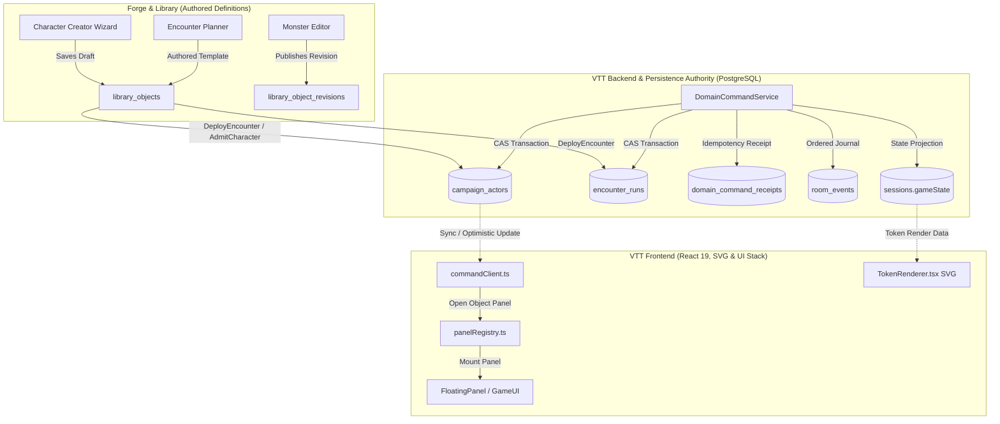
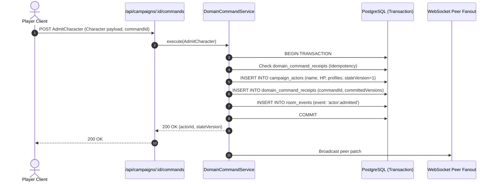
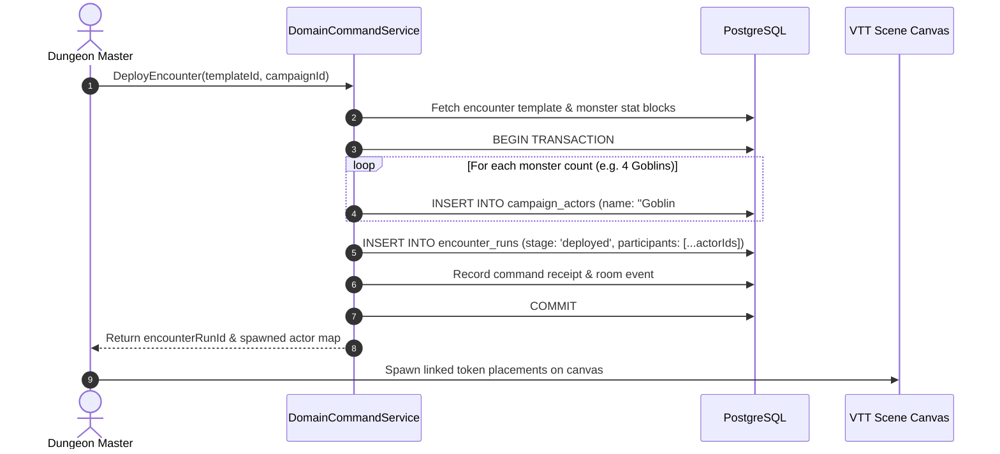
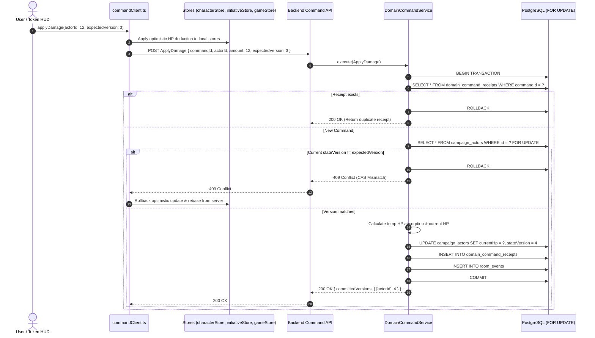
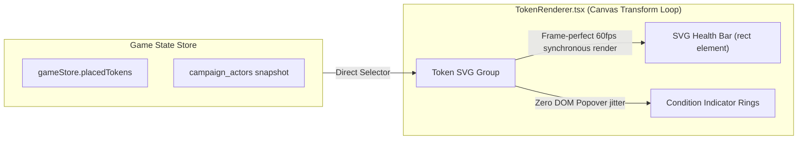

# Object models, database tables, and application data flow

This document details the authoritative domain object models, PostgreSQL database schemas, and end-to-end runtime data flows connecting Nexus Forge, the Nexus VTT backend, and the client UI.

---

## 1. System architecture & object boundaries

The Nexus platform enforces a clean boundary between **authored definitions** (templates, source builds) and **runtime campaign state** (live actors, active combat runs).



### Core Design Principles

1. **Authored Definitions vs. Live Actors**:
   - `library_objects` stores reusable, versioned templates (e.g. "Goblin" stat block, "Fireball" spell, "Goblin Ambush" encounter template). Revisions are immutable.
   - `campaign_actors` stores mutable, durable runtime instances participating in a specific campaign (e.g. "Goblin #1" with 5/7 HP).
2. **Multi-Copy Monster Resource Isolation**:
   - Deploying an encounter with 4 Goblins creates 4 distinct records in `campaign_actors`. Damaging Goblin #1 never modifies Goblin #2 or the parent template.
3. **Transactional Durability Boundary**:
   - PostgreSQL is the serialization and durability boundary. State changes, event journal appends, and idempotency receipts commit in a single ACID transaction via `pg.PoolClient`.
4. **Compare-And-Swap (CAS) Concurrency**:
   - All actor and encounter mutations require an `expectedVersion`. Concurrent writes with stale version tokens are rejected with `409 Conflict`, prompting a client rebase.
5. **Canvas Boundary Rule (ADR-0005)**:
   - Elements anchored to tokens (e.g. health bars, condition rings) render inside `TokenRenderer.tsx` as SVG elements within the canvas camera transform loop, preventing layout jitter and DOM desynchronization during zooming and panning.

---

## 2. Core domain object models (`@nexus/game-contracts`)

The `@nexus/game-contracts` workspace defines the canonical TypeScript types and Zod schemas shared across the monorepo.

### 2.1 Identity & References (`identity.ts`)

- `DomainObjectRef`: Universal object pointer:

  ```typescript
  interface DomainObjectRef {
    kind: 'character' | 'monster' | 'encounter' | 'spell' | 'item' | 'spellbook' | 'rule';
    id: string; // UUID
    revision?: number;
    campaignId?: string;
  }
  ```

- `RulesetReference`: Edition tagging (`'5e-2014' | '5e-2024'`) ensuring class progression, spell slot formulas, and condition rules evaluate against the correct SRD revision.

### 2.2 Actor Aggregate & State (`actor.ts`)

Represents the live state of any participant in a campaign:

```typescript
interface CampaignActor {
  id: string;
  campaignId: string;
  sourceRef?: DomainObjectRef;
  ownerId?: string | null;
  name: string;
  ruleset: RulesetReference;
  stateVersion: number;
  currentHp: number;
  maxHp: number;
  tempHp: number;
  conditions: ConditionState[];
  deathSaves: { successes: number; failures: number };
  resourcePools: Record<string, ResourcePool>;
  spellcastingProfiles: SpellcastingProfile[];
  inventory: ItemInstance[];
  activeSessionId?: string | null;
  payload: Record<string, unknown>; // Full character/monster backing sheet
  createdAt: string;
  updatedAt: string;
}
```

### 2.3 Character & Monster Definitions (`character.ts`, `monster.ts`)

- `CharacterDefinition`: Multi-classing data, ability scores, skill proficiencies, spell preparation capacity, equipment, and background details.
- `MonsterDefinition`: Stat block with Challenge Rating (CR), Hit Dice, Armor Class, Speed, senses, languages, trait lists, multiattack sequences, and legendary actions.

### 2.4 Encounter Templates & Runs (`encounter.ts`)

- `EncounterTemplate`: Authored definition containing monster groups, count, faction (`hostile | neutral | friendly`), and relative placement offsets.
- `EncounterRun`: Tactical combat state machine:

  ```typescript
  type EncounterStage = 'staged' | 'deployed' | 'active' | 'completed' | 'archived';

  interface EncounterRun {
    id: string;
    campaignId: string;
    templateRef: DomainObjectRef;
    stage: EncounterStage;
    deploymentCommandId: string;
    activeSessionId?: string | null;
    currentRound: number;
    currentTurnIndex: number;
    activeWaveIndex: number;
    participants: EncounterParticipant[];
  }

  interface EncounterParticipant {
    actorId: string;
    groupIndex: number;
    name: string;
    initiativeRoll?: number;
    initiativeModifier: number;
    tieBreaker: number;
    reactionUsed: boolean;
    isDefeated: boolean;
  }
  ```

### 2.5 Domain Commands & Receipts (`commands.ts`, `receipts.ts`)

All state transitions execute via typed command envelopes:

```typescript
interface DomainCommandEnvelope<T = unknown> {
  commandId: string; // UUID v4 (idempotency key)
  campaignId: string;
  aggregateId: string; // Actor ID or Encounter Run ID
  commandType:
    | 'AdmitCharacter'
    | 'ApplyDamage'
    | 'HealActor'
    | 'DeployEncounter'
    | 'StartEncounter'
    | 'AdvanceCombatTurn'
    | 'UpdateActorCondition';
  expectedVersion?: number; // CAS version check
  actorRole?: 'dm' | 'player';
  timestamp: string;
  payload: T;
}

interface CommandExecutionResult<T = unknown> {
  success: boolean;
  committedVersions: Record<string, number>;
  data?: T;
}
```

---

## 3. Database architecture & PostgreSQL tables

The backend introduces four new/expanded tables in `apps/vtt/server/schema.sql` and migration scripts:

### 3.1 `campaign_actors`

Durable live state for all active characters, monsters, companions, and summons in a campaign.

```sql
CREATE TABLE IF NOT EXISTS campaign_actors (
    id UUID PRIMARY KEY DEFAULT uuid_generate_v4(),
    "campaignId" UUID NOT NULL REFERENCES campaigns(id) ON DELETE CASCADE,
    "sourceRef" JSONB,
    "ownerId" UUID REFERENCES users(id) ON DELETE SET NULL,
    name VARCHAR(255) NOT NULL,
    ruleset JSONB NOT NULL,
    "stateVersion" BIGINT NOT NULL DEFAULT 1,
    "currentHp" INTEGER NOT NULL DEFAULT 0,
    "maxHp" INTEGER NOT NULL DEFAULT 0,
    "tempHp" INTEGER NOT NULL DEFAULT 0,
    conditions JSONB NOT NULL DEFAULT '[]'::jsonb,
    "deathSaves" JSONB NOT NULL DEFAULT '{"successes": 0, "failures": 0}'::jsonb,
    "resourcePools" JSONB NOT NULL DEFAULT '{}'::jsonb,
    "spellcastingProfiles" JSONB NOT NULL DEFAULT '[]'::jsonb,
    inventory JSONB NOT NULL DEFAULT '[]'::jsonb,
    "activeSessionId" UUID REFERENCES sessions(id) ON DELETE SET NULL,
    payload JSONB NOT NULL,
    "createdAt" TIMESTAMPTZ NOT NULL DEFAULT NOW(),
    "updatedAt" TIMESTAMPTZ NOT NULL DEFAULT NOW()
);

CREATE INDEX idx_campaign_actors_campaign ON campaign_actors("campaignId");
CREATE INDEX idx_campaign_actors_session ON campaign_actors("activeSessionId");
CREATE INDEX idx_campaign_actors_owner ON campaign_actors("ownerId");
```

### 3.2 `domain_command_receipts`

Enforces strict network idempotency. Duplicate requests return the committed result without re-executing business logic.

```sql
CREATE TABLE IF NOT EXISTS domain_command_receipts (
    "commandId" UUID PRIMARY KEY,
    "principalId" UUID NOT NULL REFERENCES users(id) ON DELETE CASCADE,
    "scopeKind" VARCHAR(32) NOT NULL,
    "scopeId" UUID NOT NULL,
    "commandType" VARCHAR(64) NOT NULL,
    "payloadHash" VARCHAR(64) NOT NULL,
    "committedAt" TIMESTAMPTZ NOT NULL DEFAULT NOW(),
    result JSONB NOT NULL
);

CREATE INDEX idx_command_receipts_scope ON domain_command_receipts("scopeKind", "scopeId");
CREATE INDEX idx_command_receipts_committed_at ON domain_command_receipts("committedAt");
```

### 3.3 `encounter_runs`

Authoritative combat tracker managing initiative orders, round/turn progression, and waves.

```sql
CREATE TABLE IF NOT EXISTS encounter_runs (
    id UUID PRIMARY KEY DEFAULT uuid_generate_v4(),
    "campaignId" UUID NOT NULL REFERENCES campaigns(id) ON DELETE CASCADE,
    "templateRef" JSONB NOT NULL,
    stage VARCHAR(32) NOT NULL DEFAULT 'staged',
    "deploymentCommandId" UUID NOT NULL,
    "activeSessionId" UUID,
    "currentRound" INTEGER NOT NULL DEFAULT 1,
    "currentTurnIndex" INTEGER NOT NULL DEFAULT 0,
    "activeWaveIndex" INTEGER NOT NULL DEFAULT 0,
    participants JSONB NOT NULL DEFAULT '[]'::jsonb,
    "createdAt" TIMESTAMPTZ NOT NULL DEFAULT NOW(),
    "updatedAt" TIMESTAMPTZ NOT NULL DEFAULT NOW()
);

CREATE INDEX idx_encounter_runs_campaign ON encounter_runs("campaignId");
CREATE INDEX idx_encounter_runs_stage ON encounter_runs(stage);
```

### 3.4 `library_objects` & `library_object_revisions`

Stores reusable templates (monsters, encounters, spells, items) owned either by a user (account scope) or pinned to a specific campaign.

```sql
CREATE TABLE IF NOT EXISTS library_objects (
    id UUID PRIMARY KEY DEFAULT uuid_generate_v4(),
    "ownerId" UUID NOT NULL REFERENCES users(id) ON DELETE CASCADE,
    "campaignId" UUID REFERENCES campaigns(id) ON DELETE CASCADE,
    kind VARCHAR(32) NOT NULL,
    name VARCHAR(255) NOT NULL,
    tags TEXT[] DEFAULT '{}',
    "currentRevision" INTEGER NOT NULL DEFAULT 1,
    "isArchived" BOOLEAN NOT NULL DEFAULT FALSE,
    "createdAt" TIMESTAMPTZ NOT NULL DEFAULT NOW(),
    "updatedAt" TIMESTAMPTZ NOT NULL DEFAULT NOW()
);

CREATE TABLE IF NOT EXISTS library_object_revisions (
    "objectId" UUID NOT NULL REFERENCES library_objects(id) ON DELETE CASCADE,
    revision INTEGER NOT NULL,
    ruleset JSONB NOT NULL,
    data JSONB NOT NULL,
    "createdAt" TIMESTAMPTZ NOT NULL DEFAULT NOW(),
    PRIMARY KEY ("objectId", revision)
);
```

---

## 4. End-to-end application & data flows

### 4.1 Flow 1: Character admission into a campaign

When a player selects a character from Forge or their account roster and admits them to a campaign:



### 4.2 Flow 2: Encounter deployment & multi-copy creature spawning

When a DM deploys a pre-authored encounter template containing multiple monsters:



### 4.3 Flow 3: Live combat damage & CAS concurrency flow

When a player or DM alters an actor's hit points (via sheet, floating panel, or token HUD):



### 4.4 Flow 4: Canvas rendering & ADR-0005 canvas boundary



Token health bars are rendered as SVG elements directly within `TokenRenderer.tsx`:

- Rendered in lockstep with token coordinates during viewport pan/zoom transformations.
- Dynamic color transitions (Green above 50%, Amber between 20% and 50%, Red at or below 20%).
- Complies strictly with the **Canvas Boundary Rule (ADR-0005)**: no floating HTML popovers for canvas-anchored status indicators.

### 4.5 Flow 5: Object panel registry & UI hosting

Object panels are dynamically hosted across dockable windows and popouts:

1. **Panel Registration (`registerPanels.ts`)**:
   - `panelRegistry.registerHost('character', CharacterPanel)`
   - `panelRegistry.registerHost('monster', MonsterPanel)`
   - `panelRegistry.registerHost('encounter', EncounterPanel)`
2. **Panel Invocation**:
   - Calling `panelRegistry.open({ kind: 'monster', id: actorId, title: 'Goblin #1' })` creates or focuses dynamic panel ID `panel:monster:${actorId}`.
3. **Docking & Popout**:
   - `panelRegistry` interacts with `useUIStackStore`, allowing panels to float, dock to grid edges, or pop out into native browser windows via `WindowPortal.tsx`.

---

## 5. Summary of API endpoints

| Endpoint | Method | Role | Description |
| -------- | ------ | ---- | ----------- |
| `/api/campaigns/:id/actors` | `GET` | Player/DM | Lists all live `campaign_actors` in a campaign. |
| `/api/campaigns/:id/actors/:actorId` | `GET` | Player/DM | Fetches full actor state, resource pools, and conditions. |
| `/api/campaigns/:id/commands` | `POST` | Player/DM | Authoritative domain command execution endpoint (CAS guarded). |
| `/api/commands` | `POST` | Player/DM | Direct command execution route for global or active room context. |
| `/api/campaigns/:id/encounters/deploy` | `POST` | DM | Resolves template and deploys isolated monster actors and run record. |
| `/api/campaigns/:id/encounters/:runId/start` | `POST` | DM | Rolls deterministic initiative and transitions stage to `active`. |
| `/api/campaigns/:id/encounters/:runId/advance` | `POST` | DM | Advances turn index, increments round counter, and resets reactions. |
