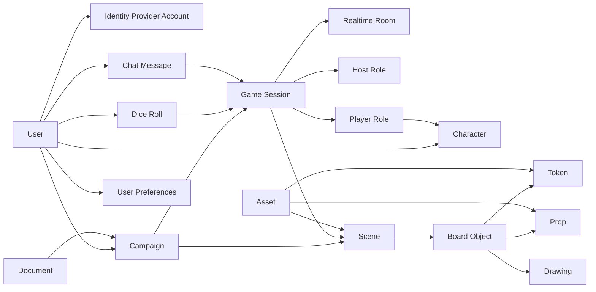

# DIV-1: Conceptual Data Model

DIV-1 identifies the high-level information concepts that exist in the Nexus VTT
domain without binding them to tables, TypeScript interfaces, or storage formats.

## Conceptual Data Model

## Concept Definitions

| Concept                   | Meaning                                                                                                  |
| ------------------------- | -------------------------------------------------------------------------------------------------------- |
| User                      | Person or guest account using Nexus VTT.                                                                 |
| Identity Provider Account | External Google/Discord identity or local credentials associated with a user.                            |
| User Preferences          | User-specific display, gameplay, privacy, accessibility, and performance settings.                       |
| Campaign                  | Persistent game collection owned by a DM/host, including scene state and recent room code.               |
| Game Session              | Runtime play instance associated with a campaign and join code.                                          |
| Realtime Room             | Active in-memory coordination space for connected WebSocket clients.                                     |
| Host Role                 | User authority to control session state, assign co-hosts, and coordinate player actions.                 |
| Player Role               | Session participant with optional character selection and connection state.                              |
| Character                 | Player-owned game character record imported, created, edited, and selected for play.                     |
| Scene                     | Map/canvas state containing visual settings and placed game objects.                                     |
| Board Object              | General conceptual object placed on or drawn over a scene.                                               |
| Token                     | Character, NPC, monster, object, vehicle, or effect representation on a scene.                           |
| Prop                      | Environmental object such as furniture, treasure, door, trap, light, or effect.                          |
| Drawing                   | Freehand, geometry, measurement, fog, lighting, notes, ping, or spell template annotation.               |
| Asset                     | Static or custom content item, such as map, token image, prop image, handout, art, or reference.         |
| Document                  | Optional NexusCodex-backed rulebook, campaign note, handout, map, character sheet, or homebrew document. |
| Dice Roll                 | Server-validated random roll result with expression, pools, totals, critical state, and privacy flag.    |
| Chat Message              | Session communication item, including text, system messages, whispers, dice output, and emotes.          |

## Conceptual Business Rules

| Rule                                           | Description                                                                                                                   |
| ---------------------------------------------- | ----------------------------------------------------------------------------------------------------------------------------- |
| Users own campaigns and characters             | Campaign ownership is represented by the DM/host relationship; characters are owned by users.                                 |
| Campaigns contain scenes                       | Scenes are the durable board content for campaigns and are also active in session state.                                      |
| Sessions activate campaigns                    | A session is a live or hibernated play instance with a join code.                                                             |
| Acknowledged canonical state is durable        | The session snapshot, content-hash token, and version become one PostgreSQL commit before clients receive an acknowledgement. |
| Concurrent canonical writers are fenced        | A writer must still match the observed token and version; a loser rebases from the committed snapshot.                        |
| Rooms are runtime-only coordination structures | A room exists while the backend process maintains live WebSocket state.                                                       |
| Players join sessions                          | A user becomes a player in a session and may bind a character.                                                                |
| Hosts administer sessions                      | A primary host and optional co-hosts control host-only actions.                                                               |
| Assets support scene objects                   | Assets provide images and metadata for maps, tokens, props, art, handouts, and references.                                    |
| Documents are optional and campaign-scoped     | Document access can be public, owner-based, or authorized by campaign participation.                                          |
