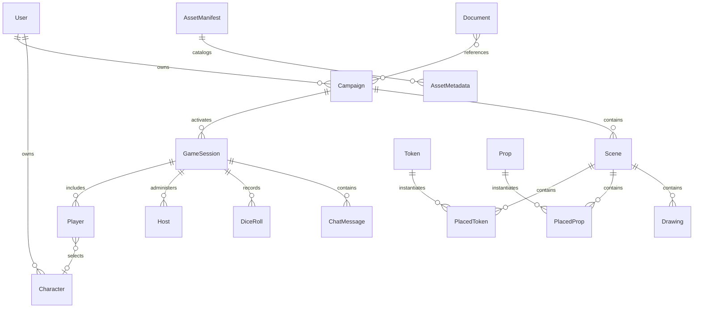

# DIV-2: Logical Data Model

DIV-2 maps the conceptual data model to logical entities, attributes, and
relationships observed in TypeScript types, backend models, REST contracts,
WebSocket messages, and store structures.

## Logical Data Model

## Logical Entities

| Logical entity | Key logical attributes | Source evidence |
| --- | --- | --- |
| User | `id`, `email`, `name`, `displayName`, `bio`, `avatarUrl`, `provider`, `preferences`, `isActive`, `type`, `connected`, `color` | `server/database.ts`, `src/types/game.ts` |
| Campaign | `id`, `name`, `description`, `dmId`, `scenes`, `lastRoomCode`, timestamps | `server/database.ts`, `server/schema.sql` |
| Character | `id`, `name`, `ownerId`/`playerId`, game stats/imported data, timestamps | `server/database.ts`, `src/types/character.ts`, `src/types/game.ts` |
| GameSession | `roomCode`, `hostId`, `coHostIds`, `campaignId`, `players`, `status`, `dmConnected` | `src/types/game.ts`, `server/types.ts` |
| Room | `code`, `host`, `coHosts`, `players`, `connections`, `status`, `gameState`, `stateVersion`, `entityVersions` | `server/types.ts` |
| Player | User fields plus `canEditScenes`, optional character link, connection state | `src/types/game.ts`, `server/database.ts` |
| Host | `userId`, `sessionId`, `permissions`, `isPrimary` | `server/database.ts`, `server/schema.sql` |
| GameState | `user`, `session`, `diceRolls`, `sceneState`, `settings`, `chat`, `voice`, `connection`, `entityVersions` | `src/types/game.ts` |
| Scene | `id`, `name`, `description`, `roomCode`, `visibility`, `backgroundImage`, `gridSettings`, `lightingSettings`, `drawings`, `placedTokens`, `placedProps` | `src/types/game.ts` |
| Token | `id`, `name`, `image`, `size`, `category`, `tags`, `stats`, `description`, visibility/custom flags, timestamps | `src/types/token.ts` |
| PlacedToken | `id`, `tokenId`, `characterId`, `sceneId`, `roomCode`, position, rotation, scale, layer, visibility, conditions, current stats | `src/types/token.ts` |
| Prop | `id`, `name`, `image`, `size`, `category`, `tags`, `stats`, interactive/light fields, timestamps | `src/types/prop.ts` |
| PlacedProp | `id`, `propId`, `sceneId`, position, rotation, scale, custom dimensions, layer, visibility, current stats | `src/types/prop.ts` |
| Drawing | Tool type, style, points/geometry, visibility, DM-only flags, spell/area metadata | `src/types/drawing.ts` |
| DiceRoll | `id`, `userId`, `userName`, `expression`, `pools`, `modifier`, `results`, `total`, `crit`, `isPrivate`, `timestamp` | `src/types/game.ts`, `server/diceRoller.ts` |
| ChatMessage | `id`, `userId`, `userName`, `content`, `messageType`, recipient, timestamp, dice data, reactions, character references | `src/types/game.ts` |
| AssetManifest | `version`, `generatedAt`, `totalAssets`, `categories`, `subcategories`, `assets` | `shared/types.ts` |
| AssetMetadata | `id`, `name`, `category`, `subcategory`, `tags`, `thumbnail`, `fullImage`, `dimensions`, `fileSize`, `format` | `shared/types.ts` |
| Document | `id`, `title`, `description`, `type`, `format`, `storageKey`, `fileSize`, `uploadedBy`, `tags`, `collections`, `campaigns`, `isPublic`, `metadata` | `src/services/documentService.ts`, `server/services/documentServiceClient.ts` |

## Logical Relationship Matrix

| Relationship | Cardinality | Notes |
| --- | --- | --- |
| User owns Campaign | One-to-many | `campaigns.dmId` and campaign API ownership checks. |
| User owns Character | One-to-many | `characters.ownerId` and character API ownership checks. |
| Campaign has GameSession | One-to-many | Sessions reference campaigns and are activated by join code. |
| GameSession includes Player | One-to-many | Players are unique by `(userId, sessionId)`. |
| GameSession has Host | One-to-many | Supports primary host plus co-hosts. |
| Player selects Character | Optional many-to-one | `players.characterId` may be null. |
| Campaign/Session contains Scene state | One-to-many logical | Stored as JSON arrays in campaign/session state rather than normalized rows. |
| Scene contains PlacedToken, PlacedProp, Drawing | One-to-many | Embedded in scene structures. |
| Token/Prop asset instantiates placed objects | One-to-many | Placed objects reference base token/prop IDs. |
| Document references Campaign | Many-to-many logical | Document metadata carries `campaigns: string[]`; access is checked by campaign authorization. |

## Logical Exchange Models

| Exchange | Logical message/data shape |
| --- | --- |
| REST request/response | JSON payloads for user, campaign, character, token, document, and asset workflows. |
| WebSocket event | Base envelope with `type`, `timestamp`, `src`, optional `dst`, and `data`. |
| Game event | `event` message where `data.name` is a slash-delimited event such as `scene/update` or `token/move`. |
| State patch | `game-state-patch` containing JSON Patch operations and version. |
| Asset catalog | `AssetManifest` with nested `AssetMetadata[]`. |
| Document proxy | NexusCodex document/search DTOs filtered by backend authorization. |

