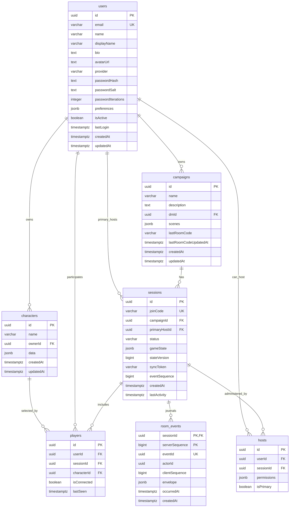

# DIV-3: Physical Data Model

DIV-3 identifies the physical data implementation: PostgreSQL tables, JSONB
fields, browser storage, files, and wire formats.

## PostgreSQL Physical Schema

## Database Tables

| Table         | Primary key                   | Important columns                                                                                                    | Notes                                                                                                                                        |
| ------------- | ----------------------------- | -------------------------------------------------------------------------------------------------------------------- | -------------------------------------------------------------------------------------------------------------------------------------------- |
| `users`       | `id UUID`                     | `email`, `name`, `displayName`, `provider`, password hash fields, `preferences JSONB`, `isActive`                    | Supports Google, Discord, guest, and local users. Passwords use PBKDF2 with per-user salt and iteration count.                               |
| `campaigns`   | `id UUID`                     | `dmId`, `scenes JSONB`, `lastRoomCode`                                                                               | Campaign scenes are stored as JSONB, allowing evolving scene structures without migrations.                                                  |
| `characters`  | `id UUID`                     | `ownerId`, `data JSONB`                                                                                              | Character sheet data is stored as flexible JSONB.                                                                                            |
| `sessions`    | `id UUID`                     | `joinCode`, `campaignId`, `primaryHostId`, `status`, `gameState JSONB`, `syncToken`, `stateVersion`, `eventSequence` | `gameState`/token/version are compare-and-swapped as one canonical commit; status is constrained to `active`, `hibernating`, or `abandoned`. |
| `room_events` | `(sessionId, serverSequence)` | `eventId`, actor/client sequence, `envelope JSONB`, timestamps                                                       | Durable room order; unique `(sessionId, eventId)` makes retries idempotent.                                                                  |
| `players`     | `id UUID`                     | `userId`, `sessionId`, `characterId`, `isConnected`, `lastSeen`                                                      | Unique `(userId, sessionId)` prevents duplicate membership rows.                                                                             |
| `hosts`       | `id UUID`                     | `userId`, `sessionId`, `permissions JSONB`, `isPrimary`                                                              | Unique `(userId, sessionId)` supports co-host management.                                                                                    |
| `session`     | `sid`                         | `sess JSON`, `expire`                                                                                                | Auto-created by `connect-pg-simple` for Express sessions, separate from game `sessions`.                                                     |

Indexes defined in `server/schema.sql` support common foreign-key and lookup
paths: campaign by DM, characters by owner, sessions by campaign, host, and
join code, players by user/session/character, and hosts by user/session.
Triggers update `updatedAt` on `users`, `campaigns`, and `characters`.

## JSONB and JSON Payload Structures

| Data object      | Physical location                                        | Key fields                                                                                                                               |
| ---------------- | -------------------------------------------------------- | ---------------------------------------------------------------------------------------------------------------------------------------- |
| `GameState`      | WebSocket payloads, `sessions.gameState`, browser stores | `user`, `session`, `diceRolls`, `sceneState`, `settings`, `chat`, `voice`, `connection`, `entityVersions`                                |
| `Scene`          | `campaigns.scenes` JSONB, `GameState.sceneState.scenes`  | `id`, `name`, `visibility`, `backgroundImage`, `gridSettings`, `lightingSettings`, `drawings`, `placedTokens`, `placedProps`, `isActive` |
| `Character.data` | `characters.data` JSONB                                  | Arbitrary/imported character payload, stats, source metadata                                                                             |
| `DiceRoll`       | WebSocket events, chat payloads, client state            | `id`, `userId`, `userName`, `expression`, `pools`, `modifier`, `results`, `total`, `crit`, `isPrivate`                                   |
| `AssetManifest`  | `ASSETS_PATH/manifest.json`, `/manifest.json` response   | `version`, `generatedAt`, `totalAssets`, `categories`, `subcategories`, `assets[]`                                                       |
| `AssetMetadata`  | Asset manifest JSON                                      | `id`, `name`, `category`, `subcategory`, `tags`, `thumbnail`, `fullImage`, `dimensions`, `fileSize`, `format`                            |
| `Document`       | NexusCodex response proxied by backend                   | `id`, `title`, `description`, `type`, `format`, `storageKey`, `fileSize`, `uploadedBy`, `tags`, `campaigns`, `isPublic`, `metadata`      |

## WebSocket Physical Message Envelope

| Message family        | Physical format                                                                                                                         |
| --------------------- | --------------------------------------------------------------------------------------------------------------------------------------- |
| Base envelope         | JSON with `type`, `timestamp`, `src`, optional `dst`, and `data`                                                                        |
| Event envelope        | `{ "type": "event", "data": { "name": "scene/update", ... } }`                                                                          |
| State acknowledgement | `{ "type": "game-state-ack", "data": { "token": string, "version": number } }` after PostgreSQL commit                                  |
| State delta           | `{ "type": "game-state-patch", "data": { "patch": [...], "baseToken": string, "newToken": string, "version": number } }`                |
| State resync          | `{ "type": "game-state-resync-required", "data": { "reason": string, "gameState": object, "serverToken": string, "version": number } }` |
| Heartbeat             | `{ "type": "heartbeat", "data": { "type": "ping or pong", "id": string, "serverTime"?: number } }`                                      |
| Errors                | `{ "type": "error", "data": { "message": string, "code"?: number } }`                                                                   |

## Browser-Side Physical Storage

| Store                              | Physical mechanism                                      | Contents                                                                           |
| ---------------------------------- | ------------------------------------------------------- | ---------------------------------------------------------------------------------- |
| `NexusVTT` IndexedDB `maps`        | IndexedDB object store keyed by `id`                    | Generated dungeon maps with base64 image data, format, sizes, timestamp, source    |
| `NexusVTT` IndexedDB `gameState`   | IndexedDB object store keyed by `id`                    | Scenes, active scene, characters, initiative, settings, timestamp, version         |
| `NexusVTT` IndexedDB `tempStorage` | IndexedDB object store                                  | Temporary generator data                                                           |
| Configurable local-first stores    | `IndexedDBAdapter` using configured store names/indexes | State snapshots, actions, sync metadata depending `hybridStateManager` config      |
| LocalStorage                       | Browser localStorage                                    | Connection context, migration buffers, feature/session helpers                     |
| Workbox caches                     | Service worker Cache Storage                            | HTML/CSS shell, JS chunks, fonts, images, `/assets/*`, selected `/api/*` responses |

## File-Based Data

| Path or source                                                                                            | Format                                 | Purpose                                          |
| --------------------------------------------------------------------------------------------------------- | -------------------------------------- | ------------------------------------------------ |
| `public/assets/defaults/manifest.json`                                                                    | JSON                                   | Bundled token/map defaults for frontend services |
| `static-assets/assets/manifest.json` or `ASSETS_PATH/manifest.json`                                       | JSON                                   | Backend asset catalog                            |
| `ASSETS_PATH/tokens/custom`                                                                               | PNG files written from base64 payloads | Custom user-created token images                 |
| `public/one-page-dungeon`, `public/city-generator`, `public/cave-generator`, `public/world-map-generator` | HTML/JS/assets                         | Embedded map/generator tools                     |

## Physical Data Implementation Notes

| Observation                                                                                        | Impact                                                                                                                              |
| -------------------------------------------------------------------------------------------------- | ----------------------------------------------------------------------------------------------------------------------------------- |
| Several durable structures use JSONB (`scenes`, `data`, `gameState`, `preferences`, `permissions`) | Schema supports fast evolution, but detailed constraints live in TypeScript and runtime validation rather than database columns.    |
| Express session data is in an auto-created `session` table                                         | Authentication/session persistence is separate from game `sessions`.                                                                |
| Canonical state ACKs follow the PostgreSQL transaction                                             | An acknowledged snapshot survives immediate backend process death; Redis and shutdown hooks are not part of the durability promise. |
| Redis has NFS-backed persistence in Compose                                                        | Versioned pub/sub messages are ephemeral; sorted-set presence and host-lease keys use renewable TTLs. PostgreSQL remains durable.   |
| Browser IndexedDB stores are versioned separately from PostgreSQL                                  | Client recovery and server persistence have distinct migration paths.                                                               |
