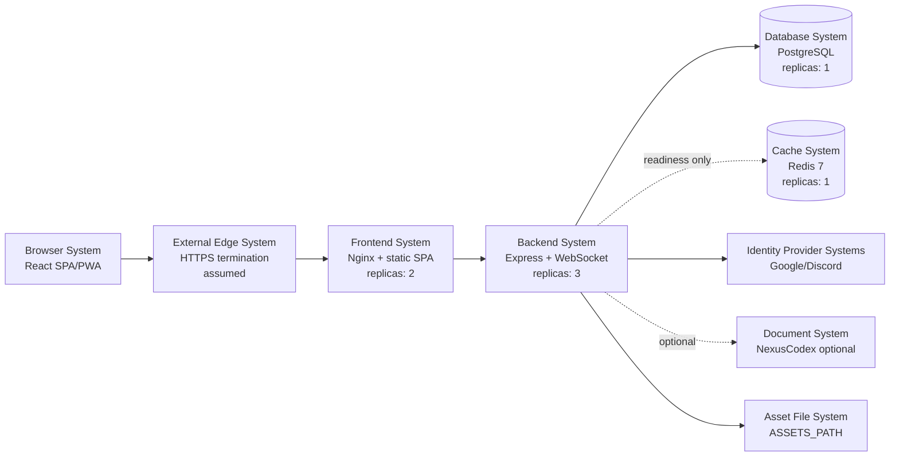

# SV-1: Systems Interface Description

The system view describes the containerized runtime systems and external systems
that compose Nexus VTT.

## System Composition

## Systems Inventory

| System | Runtime/container | Principal interfaces | Primary data responsibility |
| --- | --- | --- | --- |
| Browser System | End-user browser | HTTP(S), WS(S), IndexedDB, localStorage, service worker caches | Local UI state, cached assets, generated maps, connection context |
| Frontend System | `frontend` Nginx container | HTTP :80, reverse proxy to backend | Static SPA delivery and path routing |
| Backend System | `backend` Node container | HTTP :5000, WebSocket upgrade, PostgreSQL TCP, optional external HTTP | Application APIs, WebSocket rooms, auth, dice, persistence orchestration |
| Database System | `postgres` container | PostgreSQL TCP :5432 | Users, campaigns, characters, game sessions, players, hosts, Express sessions |
| Cache System | `redis` container | Redis TCP :6379 | Realtime fanout, expiring room presence, and host leases |
| Identity Provider Systems | Google and Discord | OAuth2 HTTPS | User identity/profile source |
| Document System | NexusCodex doc-api | HTTP JSON through `DOC_API_URL` | Optional document metadata/search/content URLs |
| Asset File System | Backend filesystem or mounted path | File I/O and static HTTP | Asset manifests and custom token files |

## System Interface Summary

| From | To | Interface | Resource exchanged |
| --- | --- | --- | --- |
| Browser | Frontend | HTTPS/HTTP | SPA shell, chunks, fonts, images |
| Browser | Backend via Frontend | REST JSON | Auth, user, campaign, character, token, document requests |
| Browser | Backend via Frontend | WebSocket JSON | Room/session events, state patches, chat, heartbeat |
| Backend | PostgreSQL | SQL over TCP | Rows, JSONB documents, Express sessions |
| Backend | Redis | Redis TCP | Startup readiness check |
| Backend | OAuth providers | OAuth2 HTTPS | Redirects, tokens, profile data |
| Backend | NexusCodex | HTTP JSON | Document CRUD/search/content metadata |

