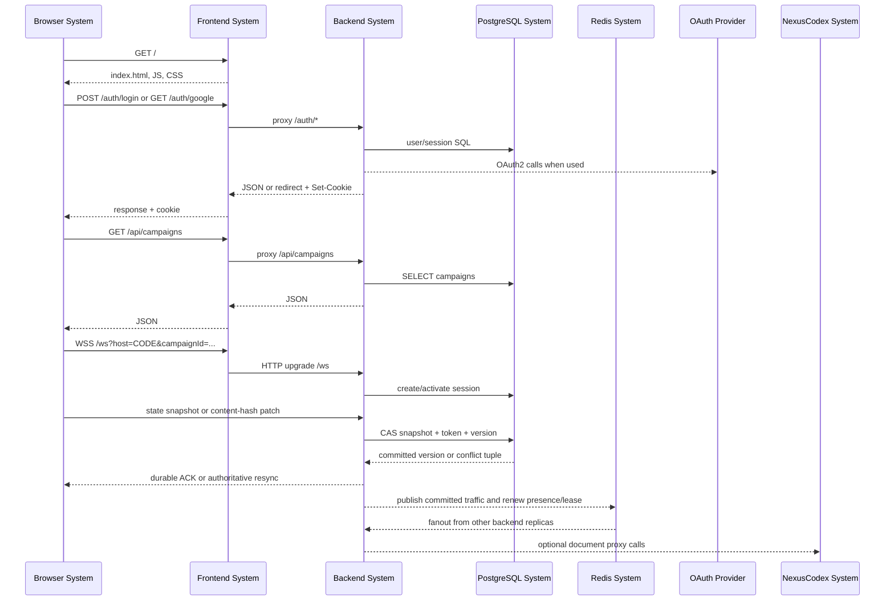

# SV-2: Systems Resource Flow Description

This system resource flow model describes how resources move between runtime
systems in the Nexus VTT deployment.

## System Resource Flow

## Resource Flow Matrix

| Producer system | Consumer system      | Resource                                                                                         | Protocol/path                    |
| --------------- | -------------------- | ------------------------------------------------------------------------------------------------ | -------------------------------- |
| Browser         | Frontend             | SPA and static asset requests                                                                    | HTTP(S) `/`, `/assets/*`         |
| Frontend        | Browser              | Built HTML, JS, CSS, fonts, image assets                                                         | HTTP(S) response                 |
| Browser         | Backend via Frontend | Auth, user, campaign, character, token, document API requests                                    | HTTP(S) JSON `/api/*`, `/auth/*` |
| Backend         | Browser via Frontend | JSON responses, redirects, cookies                                                               | HTTP(S), `Set-Cookie`            |
| Browser         | Backend via Frontend | Realtime session actions                                                                         | WebSocket `/ws` JSON             |
| Backend         | Browser              | Events, durable ACKs, JSON patches/resync snapshots, chat, dice results, errors, heartbeat pings | WebSocket JSON                   |
| Backend         | PostgreSQL           | SQL queries, canonical snapshot CAS, ordered event transactions                                  | PostgreSQL TCP :5432             |
| PostgreSQL      | Backend              | Rows and JSONB values                                                                            | PostgreSQL TCP :5432             |
| Backend         | Redis                | Versioned pub/sub, presence, host leases, readiness                                              | Redis TCP :6379                  |
| Backend         | OAuth providers      | OAuth redirects/token/profile interactions                                                       | HTTPS                            |
| Backend         | NexusCodex           | Document CRUD/search/content metadata                                                            | HTTP JSON, optional              |
