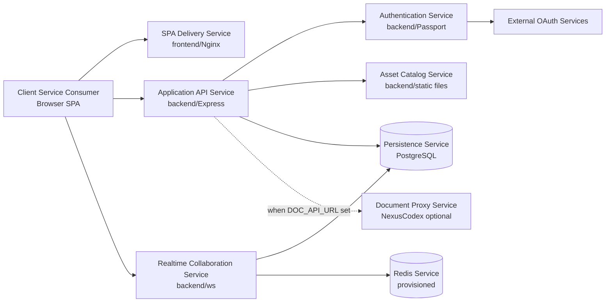

# SvcV-1: Services Context Description

The services view identifies the service resources exposed by Nexus VTT and the
external services it consumes.

## Service Composition

## Service Inventory

| Service                        | Provider                               | Consumers                     | Service contract                                                                                             |
| ------------------------------ | -------------------------------------- | ----------------------------- | ------------------------------------------------------------------------------------------------------------ |
| SPA Delivery Service           | Frontend Nginx                         | Browser                       | HTTP GET static assets and SPA fallback                                                                      |
| Application API Service        | Backend Express                        | Browser SPA                   | JSON REST under `/api/*`                                                                                     |
| Authentication Service         | Backend Express/Passport               | Browser SPA, OAuth providers  | `/auth/*`, cookie-backed sessions, OAuth callbacks                                                           |
| Realtime Collaboration Service | Backend WebSocket server               | Browser SPA                   | WebSocket JSON under `/ws`; durable canonical ACKs, patches, authoritative resync, and ordered replay        |
| Asset Catalog Service          | Backend Express/static file serving    | Browser SPA                   | `/manifest.json`, `/search`, `/category/:category`, `/asset/:id`, static paths                               |
| Persistence Service            | PostgreSQL                             | Backend                       | SQL schema, canonical snapshot compare-and-swap tuples, ordered journal, Express sessions, and JSONB records |
| Redis Coordination Service     | Redis container                        | Backend replicas              | Versioned fanout, expiring room presence, and host-lease fencing                                             |
| Document Proxy Service         | Backend routes plus NexusCodex doc-api | Browser SPA                   | `/api/documents*`, `/api/search*`, `/api/health`                                                             |
| OAuth Service                  | Google/Discord                         | Backend and browser redirects | OAuth2 authorization and profile exchange                                                                    |
