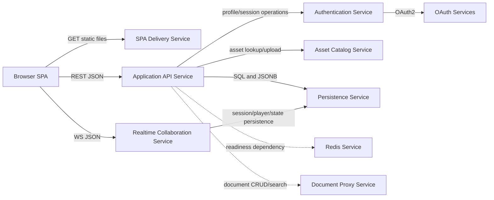

# SvcV-2: Services Resource Flow Description

This service resource flow model describes service-to-service exchanges and
consumer/provider relationships.

## Service Resource Flow

## Service Flow Matrix

| Consuming service | Providing service | Resource flow | Service interface |
| --- | --- | --- | --- |
| Browser SPA | SPA Delivery Service | Application shell and bundled assets | HTTP GET |
| Browser SPA | Application API Service | Account, campaign, character, token, document, asset requests | JSON REST |
| Browser SPA | Realtime Collaboration Service | Game events, patches, chat, dice, heartbeat | WebSocket JSON |
| Application API Service | Authentication Service | User identity, session state, OAuth callback handling | Express middleware/routes |
| Application API Service | Asset Catalog Service | Manifest search, category lookup, token uploads | HTTP/static/file I/O |
| Application API Service | Persistence Service | Users, campaigns, characters, sessions, hosts, players | SQL |
| Realtime Collaboration Service | Persistence Service | Live session activation, player presence, saved game state | SQL |
| Authentication Service | OAuth Services | Authorization and profile data | OAuth2 HTTPS |
| Application API Service | Document Proxy Service | Document metadata, upload URLs, content URLs, search results | HTTP JSON |
| Backend startup | Redis Service | Availability gate | Redis PING |

