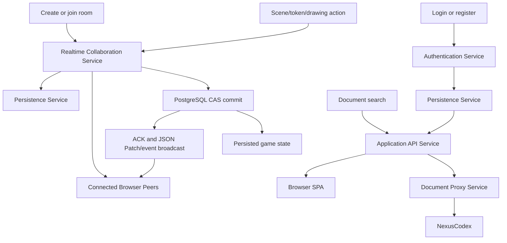

# SvcV-4: Services Functionality Description

This services functionality model describes the capabilities exposed as services
and the data each service produces or consumes.

| Service                        | Functions performed                                                                                                                                                                                                     | Inputs                                                                      | Outputs                                                                              |
| ------------------------------ | ----------------------------------------------------------------------------------------------------------------------------------------------------------------------------------------------------------------------- | --------------------------------------------------------------------------- | ------------------------------------------------------------------------------------ |
| SPA Delivery Service           | Serve static app shell, route client-side paths to `index.html`, apply cache/security headers                                                                                                                           | Browser HTTP requests, built frontend files                                 | HTML, JS, CSS, fonts, images                                                         |
| Application API Service        | Validate and execute REST workflows for profiles, preferences, guest users, campaigns, characters, token upload, assets, documents                                                                                      | JSON payloads, cookies, path/query parameters                               | JSON responses, database mutations, files                                            |
| Authentication Service         | Local login/register, OAuth callback handling, session serialization/deserialization, logout, current user lookup                                                                                                       | Credentials, OAuth profiles, session IDs                                    | User records, session cookies, auth JSON                                             |
| Realtime Collaboration Service | Create/reconnect/join rooms, maintain active connection maps, durably compare-and-swap canonical state before ACK, journal ordered actions, fan out across replicas, heartbeat clients, coordinate host/co-host actions | WebSocket query params and JSON messages, PostgreSQL tuples, Redis messages | Events, durable ACKs, patches, authoritative resync snapshots, confirmations, errors |
| Dice Service                   | Validate dice requests and produce server roll results                                                                                                                                                                  | Dice expression and roller context                                          | `dice/roll-result` event payloads                                                    |
| Asset Catalog Service          | Load manifest, search assets, filter by category, serve static asset paths, persist custom token images                                                                                                                 | Manifest JSON, static files, base64 token uploads                           | Asset metadata JSON and binary/static responses                                      |
| Persistence Service            | Store relational/JSONB state, atomically serialize canonical state token/version tuples, journal ordered events, enforce referential integrity, store Express sessions                                                  | SQL commands from backend                                                   | Committed state/version tuples, rows, constraints, indexes, persisted JSONB          |
| Document Proxy Service         | Authorize document operations and proxy NexusCodex CRUD/search/content requests                                                                                                                                         | Authenticated document requests, campaign access checks                     | Document metadata, search results, upload/content URLs                               |
| OAuth Services                 | Authenticate external identities                                                                                                                                                                                        | OAuth authorize/token/profile requests                                      | OAuth callbacks and profile claims                                                   |

## Service Function Chains

