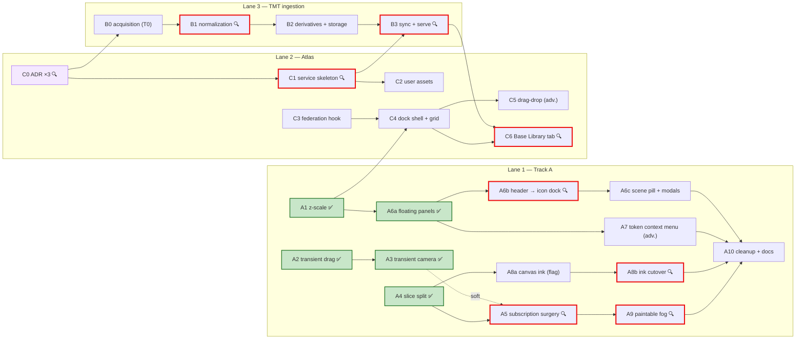

# NexusVTT Modernization — Master Roadmap

> **System of record.** Conversations do not survive between sessions; these files do.
> Every future orchestrator session boots via [RESUME_PROTOCOL.md](RESUME_PROTOCOL.md),
> reads [SESSION_STATE.md](SESSION_STATE.md), and executes exactly one packet from
> [SESSION_BRIEFS/](SESSION_BRIEFS/). Ground truth herein verified at commit `e29131b`, 2026-07-02.

## Mission

Bring NexusVTT's UX and rendering to Owlbear Rodeo 2.0 standard. Philosophy: **"Get the UI
out of the way of the map."** Map owns 100% of the viewport; chrome floats and is contextual;
interactions are transient-first (no React re-renders mid-gesture); rendering is strictly layered.

## Ratified rulings — do not re-litigate

All 14 ADRs in [ADR/](ADR/) are binding. Headlines:
- **NexusCodex stays a separate document microservice** (ADR-0001). Read-only federated source
  for the Atlas; never gains asset semantics.
- **The Atlas** = net-new asset service (backend, shape decided in packet C0 → ADR-0010/11/12)
  + frontend dock with **client-side federation** (ADR-0013) over: asset service, bundled
  token/prop libraries, NexusCodex read-only.
- **Too Many Tokens ingestion** (~16k tokens) lands in the asset service, T0-first,
  release-pinned, hash-diff synced (ADR-0014).
- Coordinate authority is `sceneUtils` (ADR-0002); placement event is `token/place`,
  unversioned (ADR-0003); one z-scale (ADR-0004); SVG/DOM/canvas layer split (ADR-0005);
  tokens + CSS Modules for net-new UI, no Tailwind migration (ADR-0006); dock overlays,
  never reflows (ADR-0007); pointer-event DnD + hand-rolled virtualization (ADR-0008);
  fog = paintable-first (ADR-0009).

## Tracks

- **Track A** — Rendering & UX migration (blueprint steps 1–11), 13 packets: A1–A5, A6a/b/c, A7, A8a/b, A9, A10.
- **Track B** — Too Many Tokens ingestion, 4 packets: B0–B3. Gated by C0.
- **Track C** — The Atlas (backend service + frontend federation), 7 packets: C0–C6.

Deferred/unscheduled: token-vision fog (needs product decision; see ADR-0009).

## Dependency DAG

**Entry points (no deps):** A1, A2, A4, C0, C3 — three lanes can advance in parallel;
a blocked lane never idles the program. **Critical paths:** A4→A5→A9 and C0→B0→B1→B2→B3→C6.
**Highest-leverage packet:** C0 (unblocks 7 packets).

## Gate policy

- **Blocking 🔍 (9):** A1, A5, A6a, A6b, A8b, A9, C0, C1, B1, B3, C6 — dependents must NOT
  dispatch until Joel reviews the diff/decision and SESSION_STATE.md gate_status = `approved`.
  (Count note: 11 marks, of which C1/C6 gate only their own successors.)
- **Advisory (2):** A7, C5 — flag for review in the PR/close-out, but dependents may proceed.

## Packet index

| ID | Packet | Depends on | Risk | Gate | Budget cap (tokens) | Key files |
|---|---|---|---|---|---|---|
| ~~A1~~ ✅ | ~~z-scale + codemod~~ **done** `47d7a55`, gate approved | — | Low | ✅ | 80k (T0+T1 10k / T3 30k) | new `src/utils/z-scale.ts`, ~15 CSS files, 3 inline TSX |
| ~~A2~~ ✅ | ~~Transient token drag~~ **done** `73ff143` | — | Low | — | 120k (T2 60k / T3 30k) | `src/components/Scene/TokenRenderer.tsx`, new `src/hooks/useTransientDrag.ts` |
| ~~A3~~ ✅ | ~~Transient camera~~ **done** `37443fe` | A2 | Low | — | 100k (T2 50k / T3 25k) | `src/components/Scene/SceneCanvas.tsx`, camera ref module |
| ~~A4~~ ✅ | ~~Store slice split~~ **done** `d0891ed` (additive realization, see SESSION_STATE) | — | Med | — | 180k (T2 90k / T1 15k / T3 40k) | new `src/stores/scene/*` (gameStore.ts untouched) |
| A5 | Subscription surgery | A4 (A3 soft) | Med | 🔍 | 160k (T2 80k / T3 50k) | `SceneCanvas.tsx` + layer components |
| ~~A6a~~ ✅ | ~~Floating panels~~ **done** `68db393`+`19ef427`, gate approved | A1 | Med | ✅ | 150k (T2 80k / T3 35k) | `GameUI.tsx`, `layout-consolidated.css`, new flag util + first CSS Module |
| A6b | Header → icon dock | A6a | Med | 🔍 | 130k (T2 70k / T3 30k) | `GameUI.tsx`, `PlayerBar.tsx`, new `PanelDock` module |
| A6c | Scene pill + modal hygiene | A6b | Low | — | 100k (T2 50k / T3 25k) | `GameUI.tsx`, `generator-panel.css` |
| A7 | Token context menu | A6a | Low-Med | adv. | 110k (T2 60k / T3 25k) | new `TokenContextMenu`, `PopoverMenu.tsx` |
| A8a | Canvas ink (flagged) | A4 | Med-High | — | 180k (T2 100k / T3 40k) | `DrawingRenderer.tsx`, new canvas layer, T0 pixel-diff harness |
| A8b | Ink cutover | A8a | Med | 🔍 | 140k (T2 70k / T3 40k) | `SelectionOverlay.tsx`, hit-test module |
| A9 | Paintable fog | A4, A5 | Med | 🔍 | 160k (T2 90k / T3 40k) | new fog layer + `fogSlice`, `EntitySyncHandler.ts` |
| A10 | Cleanup + docs | A5,A6c,A7,A8b,A9 | Low | — | 80k (T1 30k / T3 30k) | dead CSS, `CLAUDE.md` |
| C0 | Atlas ADR ×3 | — | Low | 🔍 | 100k (T1 20k / T3 60k) | `docs/roadmap/ADR/0010–0012` |
| C1 | Asset service skeleton | C0 | Med | 🔍 | 180k (T2 100k / T3 40k) | per ADR-0010 |
| C2 | User-asset domain | C0, C1 | Med | — | 150k (T2 90k / T3 35k) | asset service |
| C3 | Federation hook | — | Low-Med | — | 140k (T2 80k / T3 30k) | new `src/hooks/useAtlasAssets.ts` |
| C4 | Dock shell + grid | C3, A1 | Med | — | 150k (T2 90k / T3 30k) | new `src/components/Atlas/*` |
| C5 | Dock→canvas DnD | C4 | Med | adv. | 130k (T2 70k / T3 40k) | `src/components/Atlas/useDockToCanvasDrag.ts` |
| C6 | Base Library tab | C4, B3 | Low | 🔍 | 100k (T2 50k / T3 25k) | Atlas components + hook |
| B0 | TMT acquisition | C0 | Low | — | 60k (T0 / T1 15k / T3 25k) | new `tools/tmt-ingest/*` |
| B1 | TMT normalization | B0 | Med | 🔍 | 100k (T0 / T1 40k / T3 35k) | `tools/tmt-ingest/*` |
| B2 | Derivatives + storage | B1, C0 | Low | — | 50k (T0 / T1 10k / T3 20k) | `tools/tmt-ingest/*`, NAS layout |
| B3 | Sync + serve | B2, C1 | Med | 🔍 | 110k (T2 60k / T3 30k) | asset service + sync job |

## Packet sizing & session rules

1. One packet = one session, ending in a shippable, verifiable state (clean tree, exit
   criteria demonstrated, branch `packet/<id>` pushed or merged per gate policy).
2. Budget caps include headroom for **one** unplanned escalation. At 80% burn without exit
   criteria met: checkpoint behind a flag, split the remainder into a new packet, update
   ROADMAP + SESSION_STATE. Never die mid-flight with unsaved state.
3. Front-loading is deliberate: A1/A2 before subscription surgery; C0 ADRs before any
   pipeline or service code. Do not reorder around gates.

## Suggested next three sessions

1. **A1** (z-scale) — small, unblocks A6a and C4.
2. **C0** (Atlas ADRs) — unblocks seven packets.
3. **C3** or **A2** — both dependency-free; pick by appetite (backend-less frontend vs feel-win).

## Appendix — Program budget & savings projection (conservative estimates)

Budgeted work ≈ **2.3M tokens routed** (caps sum ≈ 3.0M):
T3 ≈ 810k · T2 ≈ 1.34M · T1 ≈ 140k · T0 ≈ 0 (deterministic scripts).

Cost-weighted at tier pricing (haiku ≈ 1/15, sonnet ≈ 1/5 of T3):
routed ≈ **1.09M T3-equivalent** vs naive all-T3 ≈ 2.3M → **~53% cost reduction**.

The dominant avoided cost is not in that ratio: T0-first TMT ingestion keeps ~16k asset
files out of model context entirely. At even ~800 tokens/asset, that is **~13M tokens that
are never spent** (ADR-0014). Sampled QA (B1) touches ≤300 assets at T1.

Ledger of past sessions lives in SESSION_STATE.md §Session log.
